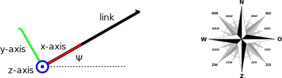
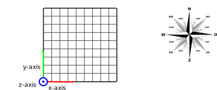

.. _`theory_area`:

.. warning::

   Under Development

Area
====

The area consists of four types of items:

#. Traffic objects
#. Static objects
#. Weather stations
#. Emergency Response Towing Vessels (ERTVs)

These items are explained in the sections below.

Traffic object
--------------

Traffic objects are used to map traffic from an appropriate data source
(e.g. AIS). This step is necessary to determine the exposures. Each ship
type and size is tagged as bounded or unbounded by default. Unbounded
ships are assigned directly to a raster cell. For bounded ships, it is
assessed whether the ship can be assigned to a shipping lane, which is
represented by a link. If not, the unassigned bounded ship is assigned
to a raster cell.

Traffic objects consist of three types of items:

- Waypoints
- Links
- Cells

Waypoints are the endpoints of a link and are represented by vertices. A
link can be considered as a vector. A single waypoint can be shared by
multiple links.

The local coordinate system of a link is shown in the figure below. The
origin is located at the start point. The x-axis of the local frame of
reference is aligned with the link. The z-axis points upwards. The
rotation of this frame with respect to the global coordinate system is
denoted as :math:`\psi` in the figure.

   Sign convention of a link

Each raster cell has its own frame of reference. The origin is located
at the southwest vertex of the cell. The axes of the local coordinate
system are aligned with the global coordinate system.

   Sign convention of a raster cell

Static object
-------------

Static objects within a navigational domain are exposed to traffic.
Navigational errors or system malfunctions may cause vessels to drift or
impact these objects directly. A variety of static object types can be
defined, each represented by open or closed polylines at a specified
elevation. Proximity to these objects is taken into account when
computing drift and ramming event rates.

Static objects may include, but are not limited to, the following types:

* Anchoring area
* Grounding area
* Platform
* Wind farm
* Wind turbine

Weather station
---------------

A weather station in an area defines the probability of weather events.
A weather station is represented by a vertex. Multiple weather stations
can be present in an area. The nearest weather station with respect to
the traffic object of interest is selected.

For each weather station, the following data is specified:

* The latitude–longitude position.
* The probability for each Beaufort scale and associated significant
  wave height. The probabilities for all wind forces sum to 1.
* The probability of wind and wave direction, specified as a vector with
  a corresponding direction vector. Each vector pair is assigned to a
  wind force. A vector pair may be reused across multiple wind forces.
  The probabilities for each vector pair sum to 1. The wind and wave
  direction follow a going-to (ENU) convention. The angle and
  probability correspond to the bin center.

Emergency Response Towing Vessel (ERTV)
---------------------------------------

The Coast Guard employs several Emergency Response Towing Vessels
(ERTVs). These vessels help prevent ships in distress from colliding
with static objects. The initial location of an ERTV in an area is
represented by a latitude–longitude vertex.

For each ERTV, a predefined route can be composed of one or more links.
At the end of this route, the ERTV can sail towards the object of
interest. The response time is computed from the travelled distance and
the default speed of the vessel. Multiple ERTVs can be added to an area.
The nearest ERTV with respect to the object of interest is selected.
