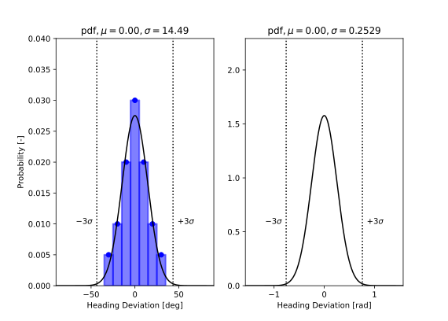
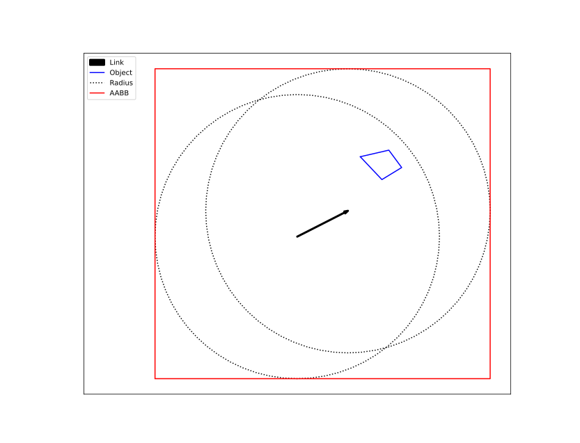
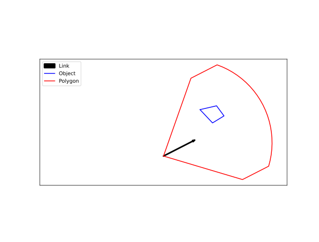
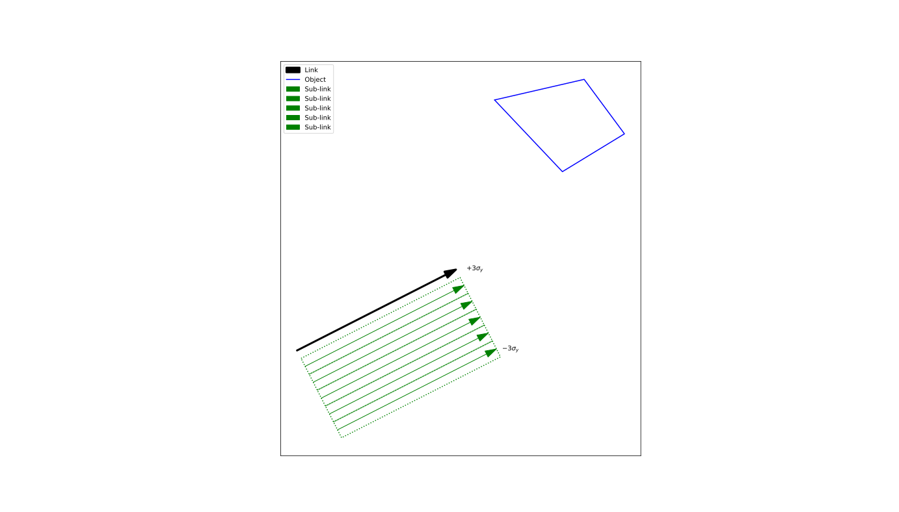
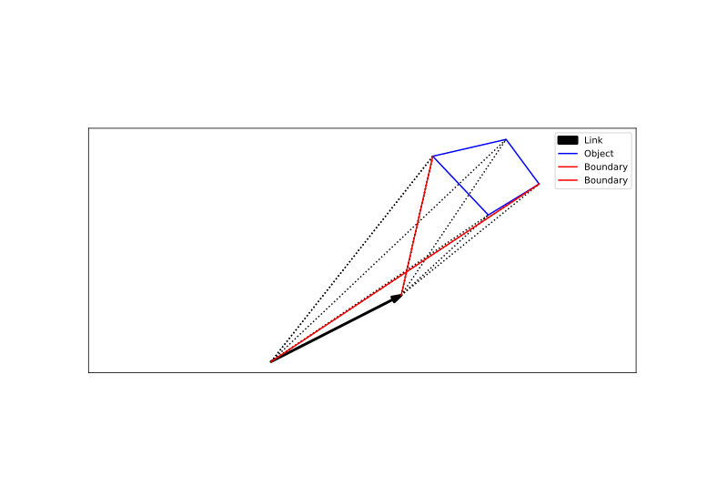
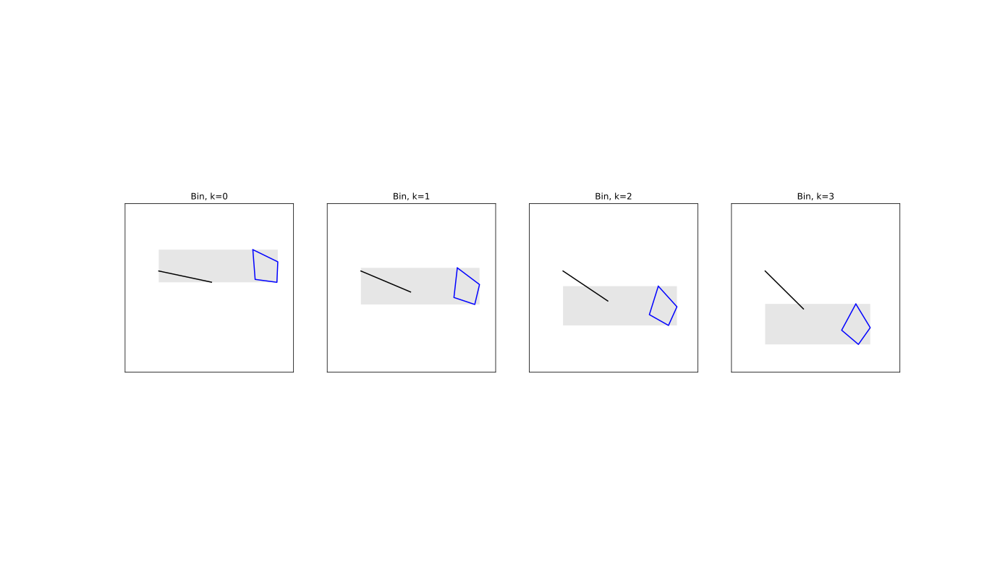

.. _`theory_exposures_shipobject`:

.. warning::

   Under Development

Ship-Object Exposures
=====================

A ship may collide with a static object located within an :ref:`area <theory_area>`. Such collisions can result from either drifting or ramming, both of 
which are explained in the following sections. The potential for a ship-object exposure is quantified as 'danger miles'—the portion of a link or cell 
where a collision will occur if the vessel exits the traffic lane and no preventive measures are taken.

A drift collision occurs as a result of an uncontrollable event, such as an engine failure, which causes the ship to lose propulsion and begin drifting. This 
failure can happen at any location at sea. Once the disturbance occurs, the vessel becomes disabled and starts drifting in a specific direction at a speed 
determined by environmental conditions such as wind, waves, and currents. A drifting vessel may pose a threat to static objects at sea. If the ship drifts 
toward such an object and no effective countermeasures are taken in time, a collision may occur. Although the drift speed is typically low, the impact can 
still cause significant damage to both the object and the vessel due to the ship’s mass and momentum.

A ram collision, on the other hand, is typically the result of navigational or human error. For example, the navigator may have temporarily left the bridge 
and, upon returning, discovers that the vessel is on a collision course with a stationary object. In such cases, emergency maneuvers—such as a hard turn or 
setting the engine to “Full Astern”—may be attempted to avoid impact. Contributing factors to such errors include medical emergencies (e.g., heart attacks), 
intoxication, fatigue, or sleep deprivation. In rare cases, more severe causes such as gross negligence or intentional actions (e.g., suicidal behavior) may 
be involved.

Nomenclature
------------

+--------------------------------------------+-----------------------------------------------------------------------+
| Symbol                                     | Meaning                                                               |
+============================================+=======================================================================+
| :math:`\mu_{\theta}`                       | Mean value of ram heading distribution                                |
+--------------------------------------------+-----------------------------------------------------------------------+
| :math:`\mu_{y}`                            | Mean value of lateral distribution for a link-ship pair               |
+--------------------------------------------+-----------------------------------------------------------------------+
| :math:`\sigma_{\theta}`                    | Standard deviation of ram heading distribution                        |
+--------------------------------------------+-----------------------------------------------------------------------+
| :math:`\sigma_{y}`                         | Standard deviation of lateral distribution for a link-ship pair       |
+--------------------------------------------+-----------------------------------------------------------------------+
| :math:`\theta_{drift}`                     | The ship's drift heading                                              |
+--------------------------------------------+-----------------------------------------------------------------------+
| :math:`\theta_{wind}`                      | Wind heading                                                          |
+--------------------------------------------+-----------------------------------------------------------------------+
| :math:`\theta_{j,min}`                     | Lower boundary of the ram exposure heading for object :math:`j`       |
+--------------------------------------------+-----------------------------------------------------------------------+
| :math:`\theta_{j,max}`                     | Upper boundary of the ram exposure heading for object :math:`j`       |
+--------------------------------------------+-----------------------------------------------------------------------+
| :math:`\boldsymbol{e}_{\textrm{current}}`  | 2D unit vector of the current velocity in the area                    |
+--------------------------------------------+-----------------------------------------------------------------------+
| :math:`\boldsymbol{e}_{\textrm{drift}}`    | 2D unit vector of the ship's (drift) velocity                         |
+--------------------------------------------+-----------------------------------------------------------------------+
| :math:`\boldsymbol{e}_{\textrm{wind}}`     | 2D unit vector of the wind velocity in the area                       |
+--------------------------------------------+-----------------------------------------------------------------------+
| :math:`v_{\textrm{current}}`               | Current speed in the area                                             |
+--------------------------------------------+-----------------------------------------------------------------------+
| :math:`v_{\textrm{drift}}`                 | Drift speed of the ship                                               |
+--------------------------------------------+-----------------------------------------------------------------------+
| :math:`v_{\textrm{drag}}`                  | Wind speed in the area                                                |
+--------------------------------------------+-----------------------------------------------------------------------+
| :math:`N_{ram}`                            | Ram exposure frequency                                                |
+--------------------------------------------+-----------------------------------------------------------------------+
| :math:`P_{i}`                              | Lateral probability for sub-link :math:`i`                            |
+--------------------------------------------+-----------------------------------------------------------------------+
| :math:`P_{k}`                              | Heading probability for bin :math:`k`                                 |
+--------------------------------------------+-----------------------------------------------------------------------+
| :math:`Q`                                  | Passing ships on a link per type and time unit                        |
+--------------------------------------------+-----------------------------------------------------------------------+
| :math:`S_{k}`                              | Projected length on the sub-link of bin :math:`k`                     |
+--------------------------------------------+-----------------------------------------------------------------------+

General
-------

The ship is geometrically represented by a rectangular block. This ship has the following attributes: width, length, draft, height and speed.  

An object is represented by a polygon in the horizontal plane. The polygon has the following attributes: type, elevation and shielding (true/false).

RAM Exposure Model
------------------

The heading distibution for a ram event is given by a table. In total seven (7) headings are considered.  

+-------------------------------------------------+-----------------+
| Course deviation compared to link heading [deg] | Probability [-] |
+=================================================+=================+
| -30                                             | 0.05            |
+-------------------------------------------------+-----------------+
| -20                                             | 0.10            |
+-------------------------------------------------+-----------------+
| -10                                             | 0.20            |
+-------------------------------------------------+-----------------+
|   0                                             | 0.30            |
+-------------------------------------------------+-----------------+
|  10                                             | 0.20            |
+-------------------------------------------------+-----------------+
|  20                                             | 0.10            |
+-------------------------------------------------+-----------------+
|  30                                             | 0.05            |
+-------------------------------------------------+-----------------+

For practical reasons this table has been converted into a continuous probability density function. This 
normal distribution fit is depicted in :numref:`fig:ShipObjectRamDis`. 

.. _fig:ShipObjectRamDis:

     
    Normal distribution fit from tabular ram heading data  

Drift Exposure Model
--------------------

The drift velocity of a ship is decomposed into three distinct components:

.. math::
    :label: eq:ve_drift

    v_{\textrm{drift}} \boldsymbol{e}_{\textrm{drift}} = 
    v_{\textrm{current}} \boldsymbol{e}_{\textrm{current}} 
    + v_{\textrm{drag}} \boldsymbol{e}_{\textrm{wind}}
    + v_{\textrm{tide}} \boldsymbol{e}_{\textrm{drift}}

Here :math:`\boldsymbol{e}` represent a unit direction vector, :math:`|\boldsymbol{e}| = 1`. The tide is only taken in the direction of the drift 
velocity. This can be rewritten as

.. math::
    :label: eq:ve_drift_tide
    
    (v_{\textrm{drift}} - v_{\textrm{tide}})\boldsymbol{e}_{\textrm{drift}} = 
    v_{\textrm{current}} \boldsymbol{e}_{\textrm{current}} 
    + v_{\textrm{drag}} \boldsymbol{e}_{\textrm{wind}}

Divide by :math:`v_{\textrm{drag}}` Renaming the first part to :math:`v_e` yields

.. math::
    :label: eq:ve_equation
    
    v_{\textrm{e}} \boldsymbol{e}_{\textrm{drift}} = 
    R \boldsymbol{e}_{\textrm{current}}
    + \boldsymbol{e}_{\textrm{wind}},

with :math:`R = \frac{v_{\textrm{current}}}{v_{\textrm{drag}}}`. Given a drift angle, windscale :math:`S` and a current :math:`C`, the 
values for the current and drag velocties can be computed as well as the current direction. It is assumed that in most cases the tide 
is not a dominant contributor and on average is zero. This leaves the equation with two unknowns, :math:`v_{\textrm{e}}` and the angle 
of the wind :math:`\theta_{\textrm{wind}}`. In theory this system can be solved, however it is possible that there is no solution. 
This is the case when the drag velocity can not overcome the current velocity in the orthogonal drift direction. This implies 
that the ship can never drift into the direction of the chosen drift angle and the probability of drifting in that directin is zero.

Finding the wind angle
~~~~~~~~~~~~~~~~~~~~~~

To compute this system of equations first multiply Eq. :eq:`eq:ve_equation` with :math:`\boldsymbol{e}_{\textrm{drift}}` and noting that the 
dot product between the same unit vectors is one, leading to

.. math::
    :label: eq:ve_one
    
    v_e = R a_0 + a_1,

with :math:`a_0 = \boldsymbol{e}_{\textrm{current}} \cdot \boldsymbol{e}_{\textrm{drift}}` and :math:`a_1 = \boldsymbol{e}_{\textrm{wind}} \cdot \boldsymbol{e}_{\textrm{drift}}`. 
This can be repeated by multiplying Eq. :eq:`eq:ve_equation` with :math:`\boldsymbol{e}_{\textrm{current}}` and :math:`\boldsymbol{e}_{\textrm{wind}}` leading 
to the equations

.. math::
    :label: eq:ve_two
    
    v_e a_0 = R + a_2

.. math::
    :label: eq:ve_three
    
    v_e a_1 = R a_2 + 1

where :math:`a_2 = \boldsymbol{e}_{\textrm{current}} \cdot \boldsymbol{e}_{\textrm{wind}}`.

Next :math:`v_e` can be eliminated be substituting Eq. :eq:`eq:ve_one` into Eq. :eq:`eq:ve_two` and Eq. :eq:`eq:ve_three`,

.. math::
    :label: eq:R_one
    
    R a_0^2 + a_0 a_1 = R + a_2

and,

.. math::
    :label: eq:R_two
    
    R a_0 a_1 + a_1^2 =  R a_2 + 1

Note that Eq. :eq:`eq:R_one` can eliminate :math:`a_2` from Eq. :eq:`eq:R_two` in a straightforward manner,

.. math::
    :label: eq:solution

    a_1^2 = R^2 (a_0^2 - 1) + 1.

The variable :math:`a_1` is now expressed in known quantities and the system is solved. The wind direction vector can now be computed by 
combining Eq. :eq:`eq:solution`, Eq. :eq:`eq:ve_one` and Eq. :eq:`eq:ve_equation`. Taking the atan2 of this vector will yield 
the angle.

It is possible that :math:`a_1^2` becomes negative. In these cases there exist no solution. Those are cases where 
:math:`v_{\textrm{current}}` and :math:`v_{\textrm{drag}}` can not compensate the velocity components in the orthogonal direction 
of :math:`\boldsymbol{e}_{\textrm{drift}}`. The limitig value of the ratio of these velocities can be estimated by setting :math:`a_1` to zero 
in Eq. :eq:`eq:solution`,

.. math::
    :label: eq:rlim
    
    R_{\textrm{lim}} = \sqrt{\frac{1}{1 - a_0^2}}

Note that :math:`a_0 \in [-1,1]` and so :math:`R_{\mathrm{lim}} \in [1,\infty]`. When :math:`R < 1` the solution is always stable. 
In cases where :math:`R > R_{\mathrm{lim}}` there will be no net velocity in the direction of the drift angle possible and hence any 
given winddirection will give no collision. These drift angles can be neglected. Observe that this equation can also be reverted, 
solving for the admissible :math:`a_0` values given the current and drag velocities.

An alternative way to compute the angle, without resorting to vectors is:

.. math:: 
    :label: eq:b1 

    b_1 = - R (\boldsymbol{e}_{\textrm{current}} \times \boldsymbol{e}_{\textrm{drift}}),

.. math:: 
    :label: eq:theta

    \theta_{\mathrm{wind}} = \theta_{\mathrm{drift}} - \textrm{atan2}(b1,a1)

It can be proven that there is only one solution when :math:`R < 1`, which is that :math:`a_1` must be positive. Take Eq. :eq:`eq:ve_equation` and consider 
these possible solutions for postive :math:`v_e`.

.. math:: 
    :label: eq:sqrt
    
    \sqrt{R^2 a_0^2 } \pm \sqrt{R^2 + a_0^2 - R^2 + 1} \geq 0.

Now observe that :math:`\sqrt{R^2 + a_0^2 - R^2 + 1} \geq \sqrt{R^2 a_0^2 }` when :math:`- R^2 + 1 > 0`. In that case the negative case 
is invalid and hence for :math:`R \leq 1` only the positive solution is valid. Now consider the case where :math:`R > 1`, then 
:math:`\sqrt{R^2 + a_0^2 - R^2 + 1} \leq \sqrt{R^2 a_0^2 }` implying that both solutions are always valid.

Tide velocity
~~~~~~~~~~~~~

The tide is modeled by a set of frequencies which is obtained from tidal measurements. The most dominating frequenties generate a 
beating pattern with frequency of :math:`\frac{f_2 - f_1}{2}` which has a period generally in the range of a month. At :math:`N_{\mathrm{steps}}` 
along this frequency, local simulations are performed in which the velocity is integrated numerically for 24 hours with a time-step of 1 
hour. If the distance never exceeds the distance to the target object then there will be no collision.

The route bound and the non-route bound procedures are discussed in the next two sections.

Route Bound
-----------

To calculate exposure frequencies for route-bound traffic, the following steps are performed:

#.  **Axis-Aligned Bounding Box (AABB) Filter** Filters geometry using axis-aligned boundaries to simplify spatial analysis.

#.  **Polygon Filter** Refines geometry filtering by considering link orientation and ram course.

#.  **Lateral Bins** Analyzes and prepares the lateral sub-links for further spatial operations.

#.  **Boundaries** Analyzes and prepares the heading range for further spatial operations.

#.  **Exposures no Shielding** Calculates the exposure frequency based on the processed spatial data for each seperate object.

    #.  **Projections** Creates bins based on the calculated boundaries and performs projections that serve as input for exposure analysis.

    #.  **Elevation Filter** Identifies and excludes object/ship type combinations that cannot result in exposure due to elevation constraints.

    #.  **Exposures** Computes the exposure frequencies for unique link/object/ship type combinations.    

#.  **Exposures with Shielding** Calculates the exposure frequency, taking into account shielding effects with all objects.

    #.  **Bins** Creates bins based on the calculated boundaries
    
    #.  **Elevation Filter** Filters out object/ship type combinations that are not exposed due to elevation constraints, and identifies relevant bins and objects for evaluation.

    #.  **Projections** Performs projections that serve as input for exposure analysis.

    #.  **Exposures** Computes the exposure frequencies for unique link/object/ship type combinations.  

The following sections provide a more detailed explanation of each step.

AABB Filter
~~~~~~~~~~~

An axis-aligned bounding box can be constructed to enclose a link. By applying an offset to this box, nearby objects within the 
surrounding area can be filtered. This offset must be reasonably considered in the analysis, especially for ships that may deviate 
from the link and potentially collide with these objects. This offset is set at :math:`2.0e+004m`. Objects whose vertices lie 
entirely outside the AABB (:numref:`fig:ShipObjectRamAabb`) are filtered out and excluded from subsequent processing.

.. _fig:ShipObjectRamAabb:

     
    Axis-Aligned Bounding Box (AABB) Filter

Polgon Filter
~~~~~~~~~~~~~ 

To further reduce the number of considered exposures, a second spatial filter is applied. It is reasonable to assume that 
the ramming direction relative to the link heading falls within the range of −0.7587 rad to +0.7587 rad. This interval corresponds 
to :math:`3\sigma` of the normal distribution.

Using these constraints, a polygonal region can be constructed with the radius from the AABB filter. Any object whose 
vertices lie entirely outside this polygon (:numref:`fig:ShipObjectRamPolygon`) is excluded from further analysis.

.. _fig:ShipObjectRamPolygon:

     
    Polygon Filter

Lateral Bins
~~~~~~~~~~~~

The lateral distribution for each ship–link combination is provided as input, modeled using a normal distribution defined by parameters 
:math:`\mu_{y}` and :math:`\sigma_{y}`. To discretize the lateral regions for further analysis, the minimum and maximum values across all ship 
types, spanning :math:`\pm3\sigma_{y}`, are used to define a rectangular area. This area is then divided into equally sized bins 
(denoted by index :math:`i` and see :numref:`fig:ShipObjectRamLatBin`) to enable structured evaluation of the exposure. The discretization 
approach is consistently applied across 
all objects under consideration. 

.. _fig:ShipObjectRamLatBin:

     
    Lateral bins of a link

Boundaries
~~~~~~~~~~

Assess whether the object (:math:`j`) intersects with the link (:math:`i`) by analyzing their geometric overlap. Identifying such intersections 
is essential for subsequent geometry processing and ensures that relevant spatial interactions are correctly captured.

Hereafter the interaction boundaries for each lateral link (:math:`i`) with object (:math:`j`) are computed. These boundaries are computed 
for each valid (:math:`ij`) pair.

The procedure can described as follows:

#.  Construct vectors from the start point of the link to each vertex of the object
   
#.  In case of no intersection between link and object:
    
    *  Construct vectors from the end point of the link to each vertex of the object
    
    *  Group the vectors originating from the start- and end point and calculate the lower and upper boundary angles 
       (see :numref:`fig:ShipObjectRamObjBound`), incorporating clipping based on the :math:`\pm3\sigma` range of the heading distribution.
    
#.  In case of intersection between link and object:    
  
    *  Group the vectors originating from the start point and calculate the lower and upper boundary angles, incorporating clipping based on 
       the :math:`\pm3\sigma` range of the heading distribution.

.. _fig:ShipObjectRamObjBound:

     
    Link object pair boundaries

Exposures no Shielding 
~~~~~~~~~~~~~~~~~~~~~~

All ship types labeled as ‘unshielded’ must adhere to the procedures outlined in this section and are exempt from those described in the ‘Exposures with Shielding’ section.

Projections
^^^^^^^^^^^

The following steps are executed to compute the distance and projected segment on the link:

#.  Make an angle discretization (bins) within the saved boundaries. An equal bin size with a maximum bin size is applied.
    
#.  Compute for the centroids of the bins (k)
  
#.  Compute the rays from the object on the sub-link

#.  Compute the projected length (:math:`S_{k}`) on the sub-link 

#.  Compute the weighed bare distance (:math:`D_{k}`) from sub-link to object 

#.  Store for each unique sub-link/object/bin group: :math:`S_{k}`, :math:`D_{k}`

.. _fig:ShipObjectRamBin:

     
    Bin computation

Elevation Filter 
^^^^^^^^^^^^^^^^

Spatial elevation filtering involves restricting the analysis to ship objects pairs, where the object elevation is within the vertical range 
of the ship type. This technique is particularly useful when assessing potential interactions between ships and surrounding objects, such as 
bridges, overhead structures, or bathymetry. No exposure can occur if the object's elevation exceeds the ship type's height or falls below its 
draft.  

Exposures
^^^^^^^^^

The exposure frequency is determined for each unique set comprising a link, sub-link, object, projection direction (bin) and ship type.

Each sub-link represents a segment of the lateral area adjacent to the main link. Based on the link-ship parameters :math:`\mu_{y}` and :math:`\sigma_{y}`, 
the probability of a ship type occupying a specific lateral position can be calculated using:

.. math::
    :label: eq_ram_prob_lateral   

    P_{i}(y) = \int ^{+y_{i}} _{-y_{i}} g(y)dy

Here :math:`\pm y_{i}` defines the boundaries of the sub-link bin's width.

Function :math:`f` is the ram heading distribution function. The probability is computed with the integral between the minimum and maximum 
:math:`\theta` values of bin :math:`k`. The link heading serves as the value of :math:`mu_{\theta}`. 

.. math::
    :label: eq_ram_prob_heading   

    P_{k}(\theta) = \int ^{+\theta_{k}} _{-\theta_{k}} f(\theta)d\theta

The exposure frequency is computed as follows:

.. math::
    :label: eq_ram_exp   

    N_{ram} = P_{i}P_{k}S_{k}Q
    
Where :math:`S_{k}` is the length of the projected geometry of object :math:`j` on sublink :math:`i` and :math:`Q` the frequency of a passing 
ship type. Each bin :math:`k` contains a value pair consisting of the projected length :math:`S_{k}` and the corresponding ram distance 
:math:`D_{k}`. Subsequently, the :math:`D_{k}` is paired with the ram exposure value. The ram distance is used in evaluating the effectiveness 
of the mitigation measure, if enabled.

The dimension of the ram exposure variable is:  

.. math::
    :label: eq_ram_exp_dim  

    N_{ram} = \frac{m}{s}

Exposure refers to the number of meters traversed per second, assuming ships depart from a link following a specified heading distribution 
and collide with an object if no mitigation measures are taken. 
To account for the probability of a ship departing the link, a causation factor is applied. This results in the calculation of the event 
frequency. When mitigation measures are enabled, the collision frequency will be reduced compared to the event frequency. 

Exposures with Shielding 
~~~~~~~~~~~~~~~~~~~~~~~~

All ship types labeled as ‘Shielded’ must adhere to the procedures outlined in this section.

Bins
^^^^

TBD

Elevation Filter 
^^^^^^^^^^^^^^^^

TBD

Projections
^^^^^^^^^^^

TBD

Exposures
^^^^^^^^^

TBD

Non-route Bound
---------------

TBD

AABB Filter
~~~~~~~~~~~

TBD

Polygon Filter
~~~~~~~~~~~~~~

TBD

Process Geometry
~~~~~~~~~~~~~~~~

TBD

Elevation Filter 
~~~~~~~~~~~~~~~~

TBD

Exposures no Shielding 
~~~~~~~~~~~~~~~~~~~~~~

TBD

Exposures with Shielding 
~~~~~~~~~~~~~~~~~~~~~~~~

TBD