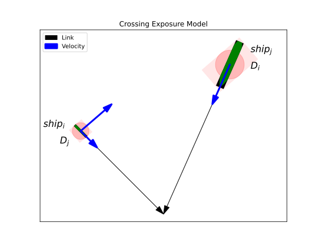
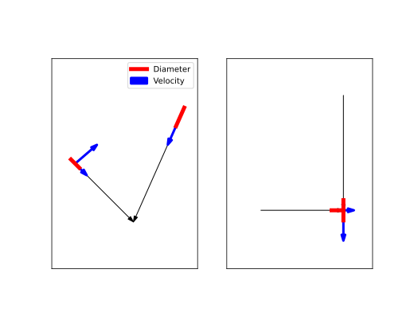
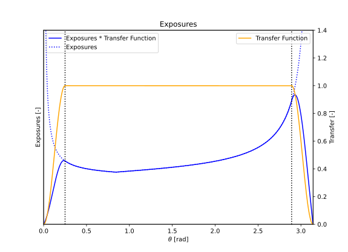
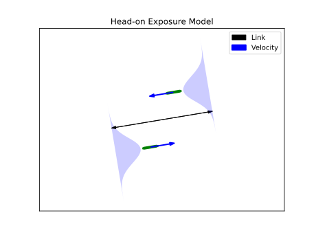
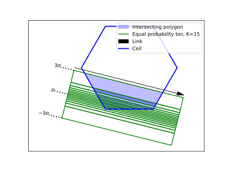
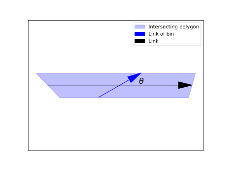
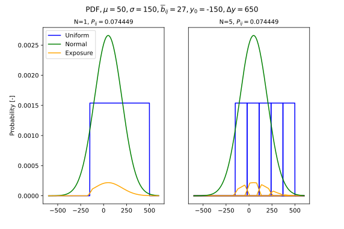
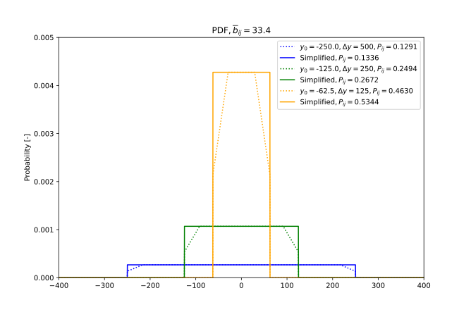

.. _`theory_shipship_exposure`:

.. warning::

   Under Development
   
Ship-Ship Exposures
===================

Traffic is described as a number of ship movements assigned to a link or a cell subdivided by ship type. The 
speed distribution depends on the ship type. This distribution can be replaced by a harmonic speed to simplify the computation. 
The harmonic speed is the correct mean value for a rate (`Wikipedia Harmonic Mean <https://en.wikipedia.org/wiki/Harmonic_mean>`_). 
This results in the correct assumption for the presence of a ship on a link with length :math:`L`. This is important for calculating 
the probability of an exposure between two ships.

For ship-ship exposures we aim to design relevant situations, which are a proper indicator for an accident between two ships. The 
computation input is the statistics of the ship traffic. Only the number of ship movements on a link or raster cell for a large time 
span is applied. The traffic time history is only available in the initial data source (AIS data). We assume that the steel structures 
of two ships overlap for the exposure computation. The probability of this overlap is computated with three models (crossing, head-on and 
overtaking). A ship-ship exposure can be considered as a collision candidate. In reality, captains will take action to avoid a collision. 
They can change the speed and course of the ship. The probability of this not happening is called the causation factor. This causation 
factor links the counted statistical exposures and the true ship-ship accidents in an area over a time span.

Nomenclature
------------

+----------------------------------+----------------------------------------------------------------------------+
| Symbol                           | Meaning                                                                    |
+==================================+============================================================================+
| :math:`\mu_i`                    | Mean value of ship :math:`i` lateral distribution                          |
+----------------------------------+----------------------------------------------------------------------------+
| :math:`\mu_j`                    | Mean value of ship :math:`j` lateral distribution                          |
+----------------------------------+----------------------------------------------------------------------------+
| :math:`\rho_i`                   | Cell density of ship :math:`i`                                             |
+----------------------------------+----------------------------------------------------------------------------+
| :math:`\rho_j`                   | Cell density of ship :math:`j`                                             |
+----------------------------------+----------------------------------------------------------------------------+
| :math:`\sigma_i`                 | Standard devation of ship :math:`i` lateral distribution                   |
+----------------------------------+----------------------------------------------------------------------------+
| :math:`\sigma_j`                 | Standard devation of ship :math:`j` lateral distribution                   |
+----------------------------------+----------------------------------------------------------------------------+
| :math:`\Delta\theta`             | Exposure angle bin size                                                    |
+----------------------------------+----------------------------------------------------------------------------+
| :math:`\theta`                   | Exposure angle                                                             |
+----------------------------------+----------------------------------------------------------------------------+
| :math:`\theta_{ij}`              | Exposure angle between ship :math:`i` and :math:`j`                        |
+----------------------------------+----------------------------------------------------------------------------+
| :math:`\theta_{lim}`             | Set threshold for the exposure angle                                       |
+----------------------------------+----------------------------------------------------------------------------+
| :math:`b_i`                      | Ship :math:`i` width                                                       |
+----------------------------------+----------------------------------------------------------------------------+
| :math:`\overline{b}_{ij}`        | Average width of ship :math:`i` and :math:`j`                              |
+----------------------------------+----------------------------------------------------------------------------+
| :math:`b_j`                      | Ship :math:`j` width                                                       |
+----------------------------------+----------------------------------------------------------------------------+
| :math:`l_i`                      | Ship :math:`i` length                                                      |
+----------------------------------+----------------------------------------------------------------------------+
| :math:`l_j`                      | Ship :math:`j` length                                                      |
+----------------------------------+----------------------------------------------------------------------------+
| :math:`u_i`                      | Harmonic speed of ship :math:`i`                                           |
+----------------------------------+----------------------------------------------------------------------------+
| :math:`u_j`                      | Harmonic speed of ship :math:`j`                                           |
+----------------------------------+----------------------------------------------------------------------------+
| :math:`u_{ij}`                   | Relative speed between ship :math:`i` and :math:`j`                        |
+----------------------------------+----------------------------------------------------------------------------+
| :math:`{\Delta}{y}_{k}`          | Width of bin :math:`k`                                                     |
+----------------------------------+----------------------------------------------------------------------------+
| :math:`A`                        | Cell area                                                                  |
+----------------------------------+----------------------------------------------------------------------------+
| :math:`A_k`                      | Area of bin :math:`k`                                                      |
+----------------------------------+----------------------------------------------------------------------------+
| :math:`D_i`                      | Apparent exposure diameter of ship :math:`i`                               |
+----------------------------------+----------------------------------------------------------------------------+
| :math:`D_j`                      | Apparent exposure diameter of ship :math:`j`                               |
+----------------------------------+----------------------------------------------------------------------------+
| :math:`D_{ij}`                   | Apparent exposure diameter of ship :math:`i` and :math:`j`                 |
+----------------------------------+----------------------------------------------------------------------------+
| :math:`K`                        | Number of bins                                                             |
+----------------------------------+----------------------------------------------------------------------------+
| :math:`L`                        | Link length                                                                |
+----------------------------------+----------------------------------------------------------------------------+
| :math:`N_{cross}`                | Number of crossing exposures per time unit                                 |
+----------------------------------+----------------------------------------------------------------------------+
| :math:`N_{e}`                    | Number of exposures per time unit                                          |
+----------------------------------+----------------------------------------------------------------------------+
| :math:`N_{head}`                 | Number of head-on exposures per time unit                                  |
+----------------------------------+----------------------------------------------------------------------------+
| :math:`N_{over}`                 | Number of overtaking exposures per time unit                               |
+----------------------------------+----------------------------------------------------------------------------+
| :math:`P_{\theta}`               | The exposure angle probability                                             |
+----------------------------------+----------------------------------------------------------------------------+
| :math:`P_{ij}`                   | The probability that ship :math:`i` overlaps ship :math:`j`                |
+----------------------------------+----------------------------------------------------------------------------+
| :math:`Q_{i}`                    | Number of passages per time unit for each ship type and size (:math:`i` )  |
+----------------------------------+----------------------------------------------------------------------------+
| :math:`Q_{j}`                    | Number of passages per time unit for each ship type and size (:math:`j` )  |
+----------------------------------+----------------------------------------------------------------------------+

Exposure models
---------------

In total three exposure models are available, denoted as:

*  Crossing ships model

*  Head-on ships model

*  Overtaking ships model

These model are discussed in the following sections and derived from the method proposed by Pedersen in :cite:`Pedersen_1995`.

Crossing ships model
~~~~~~~~~~~~~~~~~~~~

The relative velocity (:math:`u_{ij}`) between ship :math:`i` and ship :math:`j` is computed as follows:

.. math::
    :label: eq_rr_rel_vel_cross
    
    u_{ij}=\sqrt{u_{i}^2+u_{j}^2-2u_{i}u_{j}cos(\theta)}

The number of exposures between two adjacent links per time unit are defined as follows:

.. math::
    :label: eq_rr_num_cross

    N_{cross}=\sum_{i=1}^{i=n}\sum_{j=1}^{j=n}\frac{D_{ij}}{sin(\theta)}\frac{Q_iQ_j}{u_iu_j}u_{ij}   
    
Where :math:`D_{ij}` is the apparent exposure diameter of the two crossing ships: 

.. math:: 
    :label: eq_rr_dia_sum

    D_{ij}=D_i+D_j 

The apparent exposure diameter of ship :math:`i` is constructed with the contour of ship :math:`j`:
    
.. math::
    :label: eq_rr_dia_i

    D_{i}=\frac{l_{j}u_{i}sin(\theta)}{u_{ij}}+b_{j}\sqrt{(1-(sin(\theta)u_{i}/u_{ij})^2)}      
         
The apparent exposure diameter of ship :math:`j` is constructed with the contour of ship :math:`i`:
    
.. math::
    :label: eq_rr_dia_j

    D_{j}=\frac{l_{i}u_{j}sin(\theta)}{u_{ij}}+b_{i}\sqrt{(1-(sin(\theta)u_{j}/u_{ij})^2)}      

The apparent exposure diameter is constructed with a rectangle. This rectangle is the envelope of a 2D ship contour and its side edges are 
parallel with the relative velocity vector. The value of the diameter depends on the ship size (:math:`b` and :math:`l`) and the orientation 
of the relative velocity vector (see: :numref:`fig:ShipShipModelCrossing`).

.. _fig:ShipShipModelCrossing:

     
    Crossing exposures

The computed number of exposures per time unit (:math:`N_{cross}`) are applicable for a pair of links. These exposures must be assigned to 
both ships with the ratios :math:`D_{i}/D_{ij}` and :math:`D_{j}/D_{ij}`, because ship :math:`i` is exposed to ship :math:`j` and vice versa. The 
ratio :math:`D_{i}/D_{ij}` represents the fraction of exposures in which ship :math:`i` is the striking vessel and :math:`D_{j}/D_{ij}` 
corresponds with the fraction ship :math:`j` is the striking vessel. For simplicity the fractions are listed in the table below.

.. table:: Exposure fractions for striking and struck ships

    +----------+--------------------+--------------------+
    |          | Ship :math:`i`     | Ship :math:`j`     |
    +==========+====================+====================+
    | Striking | :math:`D_i/D_{ij}` | :math:`D_j/D_{ij}` |
    +----------+--------------------+--------------------+
    | Struck   | :math:`D_j/D_{ij}` | :math:`D_i/D_{ij}` |
    +----------+--------------------+--------------------+

The setup in :numref:`fig:ShipShipModelCrossing` can be simplified as displayed in :numref:`fig:ShipShipModelCrossingSimple`. In the left figure 
the circular representations are replaced with line segments with a length :math:`D_i` and :math:`D_j`, each accompanied by their respective 
velocity vectors. This abstraction allows for further simplification, as illustrated in the right figure. Consequently, Monte Carlo simulations 
can be utilized to validate the analytical solution.

.. _fig:ShipShipModelCrossingSimple:

     
    Crossing exposures simplified 

The lateral distribution of the traffic on a link has no impact on the exposure. It only impacts the location of the impact, 
which is not considered in the crossing model.

Due to the :math:`sin(\theta)` term in the denominator of Eq. :eq:`eq_rr_num_cross`, the exposure goes to :math:`\infty` for :math:`\theta \to 0` 
and :math:`\theta \to \pi`. This phenomenon is mitigated by applying a transfer function to the computed exposures. The underlying concept is illustrated in
:numref:`fig:ShipShipTransition`.

.. _fig:ShipShipTransition:

     
    Transfer signal

The equation of the transfer function:

.. math::
    :label: eq_rr_transfer

    f(\theta) = 
    \begin{cases}
    sin^2(\frac{\pi}{2} \cdot \frac{\theta}{\theta_{lim}}) &  \theta < \theta_{lim} \\
    1 & \theta_{lim} \leq \theta \leq \pi - \theta_{lim}\\
    sin^2(\frac{\pi}{2} \cdot (1+\frac{\theta-\pi+\theta_{lim}}{\theta_{lim}})) & \theta > \pi-\theta_{lim}
    \end{cases}

The value of :math:`\theta_{lim}` is set on :math:`0.25` rad.

Head-on ships model
~~~~~~~~~~~~~~~~~~~

The exposure angle for head-on exposures is equal to :math:`\pi`. The relative velocity (:math:`u_{ij}`) between ship :math:`i` and ship 
:math:`j` is computed as follows:

.. math::
    :label: eq_rr_rel_vel_head
    
    u_{ij}=u_{i}+u_{j}

The number of exposures between two adjacent links per time unit are defined as follows:

.. math::
    :label: eq_rr_num_head
    
    N_{head}=L\sum_{i=1}^{i=n}\sum_{j=1}^{j=n}P_{ij}\frac{Q_iQ_j}{u_iu_j}u_{ij}
    
The link length (:math:`L`) and the lateral distributions of ship :math:`i` and :math:`j` are taken into account. The term :math:`P_{ij}` 
represents the probability that ship :math:`i` overlaps ship :math:`j`. The ships width is used to compute this probability. The sum of two 
independent normally distributed random variables is normal, with its mean being the sum of the two means, and its variance being the sum of 
the two variances. This approach is explained on this `Wikipedia Sum Distribution 
<https://en.wikipedia.org/wiki/Sum_of_normally_distributed_random_variables#:~:text=This%20means%20that%20the%20sum,squares%20of%20the%20standard%20deviations)>`_ page. 
The :math:`\mu` and :math:`\sigma` of the sum distribution are denoted as :math:`\mu_{ij}` and :math:`\sigma_{ij}` and computed as follows:

.. math::
    :label: eq_rr_sum_mu
    
    \mu_{ij} = \mu_{i} + \mu_{j}
    
.. math::
    :label: eq_rr_sum_sigma
    
    \sigma_{ij}=\sqrt{(\sigma_{i}^2+\sigma_{j}^2)}   

The mean width of ship :math:`i` and :math:`j` is equal to:
    
.. math::
    :label: eq_rr_mean_width

    \overline{b}_{ij}=\frac{b_i+b_j}{2}

Function :math:`F` represents the cumulative probability function (CDF) of the sum distribution of ship :math:`i` and :math:`j`. The boundaries 
:math:`-\overline{b}_{ij}` and :math:`+\overline{b}_{ij}` represent the case that the rectangular shapes of the both ship overlap (=exposure).

.. math::
    :label: eq_prop_head
    
    P_{ij}=P[-\overline{b}_{ij}<Z<+\overline{b}_{ij}]=F(+\overline{b}_{ij})-F(-\overline{b}_{ij})

In case of a normal distribution the cumulative probability function is denoted as :math:`\Theta`. 

.. math::
    :label: eq_rr_prop_head_Theta
    
    P_{ij}=\Theta(+\overline{b}_{ij},\mu_{ij},\sigma_{ij})-\Theta(-\overline{b}_{ij},\mu_{ij},\sigma_{ij})    

.. _fig:ShipShipModelHeadOn:

     
    Head-on exposures

Overtaking ships model
~~~~~~~~~~~~~~~~~~~~~~ 

The exposure angle for overtaking exposures is equal to zero. The relative velocity (:math:`u_{ij}`) between ship :math:`i` and ship 
:math:`j` is computed as follows:

.. math::
    :label: eq_rr_rel_vel_over
    
    u_{ij}=u_{j}-u_{i}

The computation for overtaking is very simular to the head-on case. However the following aspects deviate:

1.  Ship :math:`i` and :math:`j` sail on the same link and share therefore the same particulars for the lateral distributions and the 
    number of passages per time unit.
    
2.  The relative speed can be negative. These cases are omitted.

.. math::
    :label: eq_rr_num_over
    
    N_{over}=L\sum_{i=1}^{i=n}\sum_{j=1}^{j=n}P_{ij}\frac{Q_iQ_j}{u_iu_j}u_{ij}
    
The computation of :math:`P_{ij}` is equal to the head-on case.    

Route-bound
-----------

Crossing ships
~~~~~~~~~~~~~~

The crossing ships model is applied for the following conditions:

*  For each waypoint in the area the unique pair of links that share the same waypoint with their endpoint (arrowhead) are listed.

*  The exposure angle must fulfil the following condition for the listed paired links: :math:`{\theta}_{lim}<{\theta}<{\pi}-{\theta}_{lim}`

Head-on ships
~~~~~~~~~~~~~

The head-on ships model is applied for the following condition:

*  A head-on exposure can only take place with two links that share the same waypoints with an opposite order and thus direction (:math:`{\theta}={\pi}`).  

Overtaking ships
~~~~~~~~~~~~~~~~

The overtaking ships model is applied for the following condition:

*  It is applicable for all links in an area. 

Route-bound - non-route-bound
-----------------------------

The density of non-route-bound traffic in an area is depicted by cells. Each cell can contain multiple densities, each representing an unique 
ship type and size. Interactions between these cells and the links can be identified through the intersection geometry of the cells and the 
boundaries of the normal distribution associated with the link. The normal distribution is divided into bins (polygons) with equal probability, 
resulting in multiple intersecting polygons. An example of these intersections is displayed in :numref:`fig:LinkCellIntersection`.

.. _fig:LinkCellIntersection:

     
    Link cell intersection

Crossing ships
~~~~~~~~~~~~~~

The crossing model from Eq. :eq:`eq_rr_num_cross` can also be applied here. Only special attention is needed for the 
assignment of the flow parameters :math:`Q_i` and :math:`Q_j`. A uniform lateral distribution of sailing ships in a cell 
is assumed. Default a uniform distribution of ship's courses is assumed. In :numref:`fig:LinkCellCrossing` a single 
intersecting polygon from :numref:`fig:LinkCellIntersection` is depicted. In this example we assume that :math:`Q_i` originates 
from the link (black arrow) and :math:`Q_j` from the cell (blue arrow). The intersecting bins are denoted with index :math:`k` and 
the total number with :math:`K`. 

.. _fig:LinkCellCrossing:

     
    Crossing model applied on intersecting polygon

The number of passages per time unit of ship :math:`i` in bin :math:`k` is computed as follows:

.. math::
    :label: eq_qik_rb_nrb
    
    Q_{i,k} = \frac{Q_{i}}{K}

The number of passages per time unit of ship :math:`j` in bin :math:`k`, which originates from the cell density :math:`\rho_j` 
of ship :math:`j` is computed as follows:
    
.. math::
    :label: eq_qjk_rb_nrb   

    Q_{j,k} = \frac{\rho_{j} u_j A_k}{L_k}

:math:`A_k` is the intersecting bin area. The link length :math:`L_k` depends on the bin width (:math:`{\Delta}y_k`) and the applicable 
crossing angle :math:`\theta`. The density is defined as the presence ratio (:math:`s s^{-1}`) per unit area. 

The link length is computed as follows:

.. math::
    :label: eq_lk_rb_nrb 
    
    L_k\left( \theta \right)=\frac{{\Delta}y_k}{sin(\theta)}
    
A dimension analysis of Eq. :eq:`eq_qjk_rb_nrb` is given below:

.. math::
    :label: eq_qjk_dim_rb_nrb
    
    \frac{s}{s m^2}\frac{m}{s} m^2 m^{-1} = s^{-1}  

This corresponds with the number of passages per time unit on a link.

Head-on ships
~~~~~~~~~~~~~

A cell exhibits a uniform lateral distribution, whereas the link follows a normal distribution. The sum distribution required 
to compute :math:`P_{ij}` in Eq. :eq:`eq_rr_num_head` can only be obtained through numerical integration, specifically using the 
trapezium rule.

.. math::
    :label: eq_pij_num_rb_nrb
    
    P_{ij} = \int_{-\infty }^{\infty }f_{i}\left( y,\mu_i,\sigma_i \right)\left[ F_{j}(y+\overline{b}_{ij},y_k,{\Delta}y_k) - F_{j}(y-\overline{b}_{ij},y_k,{\Delta}y_k) \right] dy   

Where :math:`f_{i}` represents the probability function of the ship on the link, and :math:`F_{j}` is the cumulative distribution function 
of a uniform distribution. The integral calculates the probability that the centerline of ship :math:`j` is within a distance of 
:math:`\overline{b}_{ij}` from the centerline of ship :math:`i`.

In :numref:`fig:LinkCellHeadOn` an assessment of the bin size and number is presented. For simplicity, equally sized bins are used in this example. 
The area under the probability density function of the exposure (orange line) represents the probability of the occurrence. It can be observed 
that the discretization has no impact on the computed probability in this example. Note that the width of the slope on both sides of a probability 
density function (PDF) is equal to :math:`\overline{b}_{ij}`. 

.. _fig:LinkCellHeadOn:

     
    Head-on model applied on intersecting polygons

Finally, the terms :math:`L` and :math:`Q_j` in Eq. :eq:`eq_rr_num_head` must be replaced to make it applicable for a cell and a link.  

.. math::
    :label: eq_qj_rb_nrb
    
    LQ_j = L_k P_{\theta} \left( \theta \right) \frac {\rho_j u_j A_k}{L_k}, \quad \theta \in \left[ \pi - \frac{\Delta\theta}{2}, \pi + \frac{\Delta\theta}{2} \right]

Which can be simplified to:

.. math::
    :label: eq_qj_sim_rb_nrb
    
    LQ_j = P_{\theta} \left( \theta \right) \rho_j u_j A_k, \quad \theta \in \left[ \pi - \frac{\Delta\theta}{2}, \pi + \frac{\Delta\theta}{2} \right]

Where :math:`\Delta\theta` is the bin size of the angle between two links and :math:`P\left( \theta \right)` is the probability that an exposure angle occurs. 

Overtaking ships
~~~~~~~~~~~~~~~~

Only the formulation of Eq. :eq:`eq_qj_sim_rb_nrb` must be modified to make it applicable for the overtaking model.

.. math::
    :label: eq_qj_sim_over_rb_nrb
    
    LQ_j = P_{\theta} \left( \theta \right) \rho_j u_j A_k, \quad \theta \in \left[ -\frac{\Delta\theta}{2}, \frac{\Delta\theta}{2} \right]
    
Non-route-bound 
---------------

For non-route-bound traffic, only the cell density is taken into account. The exposure rates for crossing, head-on, and overtaking 
scenarios are calculated per cell. Interactions between adjacent cells are not considered.

Crossing ships
~~~~~~~~~~~~~~

The terms :math:`Q_i` and :math:`Q_j` in Eq. :eq:`eq_rr_num_cross` must be replaced to make it applicable to compute the crossing exposure 
rates for a cell. The other terms are only dependent on the ship particulars and the crossing angle :math:`\theta`. 

.. math::
    :label: eq_qiqj_nrb_nrb
    
    Q_i Q_j = \frac{\rho_i u_i A}{L} \frac{\rho_j u_j A}{L}  
    
We assume the following relationship between the length :math:`L` and the area :math:`A`: 

.. math::
    :label: eq_area_nrb_nrb    
    
    A = L^2

This assumption is valid under the condition that the arbitrary polygonal domain of a cell is discretized into a finite number of smaller 
squares, allowing for the approximation of integrals or other spatial operations using a piecewise uniform representation. 
As a result Eq. :eq:`eq_qiqj_nrb_nrb` can be simplified as follows: 
    
.. math::
    :label: eq_qiqj_nrb_nrb_sim
    
    Q_i Q_j = P_{\theta} \left( \theta \right) \rho_i \rho_j u_i u_j A, \quad \theta \in \left[ 0, \pi \right]   

This results in:

.. math::
    :label: eq_qiqj_nrb_nrb_sim_tot

    N_{cross} = \sum P_{\theta} \left( \theta \right) D_{ij} \rho_i \rho_j A u_{ij}, \quad \theta \in \left[ 0, \pi \right]   

Where :math:`D_{ij}` and :math:`u_{ij}` are function of :math:`\theta`, :math:`u_i` and :math:`u_j`.      

Head-on ships
~~~~~~~~~~~~~

A cell exhibits a uniform lateral distribution. The sum distribution required to compute :math:`P_{ij}` in Eq. :eq:`eq_rr_num_head` can 
directly be obtained by the sum distribution of two uniform distributions.

.. math::
    :label: eq_pij_head_nrb_nrb
    
    P_{ij} = \frac{1}{\Delta{y}} \left( 2\overline{b}_{ij} - \frac{{\overline{b}_{ij}}^2}{\Delta{y}} \right)

The second term within the parentheses corresponds to the chamfers at the top of the dotted lines in :numref:`fig:CellCellHeadOn`. This shape arises 
because interactions with neighboring cells are not taken into account. In reality, adjacent cells with non-zero density values would be present. 
Moreover, the resulting value is relatively small compared to the cell size.

Therefore, it is reasonable to simplify Eq. :eq:`eq_pij_head_nrb_nrb`:
    
.. math::
    :label: eq_pij_head_nrb_nrb_sim
    
    P_{ij} = \frac{2\overline{b}_{ij}}{\Delta{y}}
    
.. _fig:CellCellHeadOn:

     
    Head-on model applied on non route bound ships

Finally, the terms :math:`P_{ij}`, :math:`Q_i`, :math:`Q_j` in Eq. :eq:`eq_rr_num_head` must be substituted by 
Eq. :eq:`eq_pij_head_nrb_nrb_sim` and Eq. :eq:`eq_qjk_rb_nrb` to make it applicable for a cell.  

.. math::
    :label: eq_pijlqiqj_nrb_nrb
    
    P_{ij}LQ_iQ_j = P_{\theta} \left( \pi \right) \frac{2\overline{b}_{ij}}{\Delta{y}} L \frac{\rho_i u_i A}{L} \frac{\rho_j u_j A}{L}
    
Substitute :math:`\Delta y` with the following equation:

.. math::
   :label: eq_pijlqiqj_area
   
   A = \Delta y L

This results in:

.. math::
    :label: eq_pijlqiqj_nrb_nrb_sim

    P_{ij}LQ_iQ_j = P_{\theta} \left( \pi \right) 2\overline{b}_{ij} \rho_i \rho_j u_i u_j A
   
and:

.. math::
    :label: eq_pijlqiqj_nrb_nrb_sim_tot   

    N_{head} = P_{\theta} \left( \pi \right) 2\overline{b}_{ij} \rho_i \rho_j A \left( u_i + u_j \right)

This is equivalent to setting :math:`\theta=\pi` in Eq. :eq:`eq_qiqj_nrb_nrb_sim_tot`. If term :math:`A` is omitted from Eq. :eq:`eq_pijlqiqj_nrb_nrb_sim_tot`, 
the exposure frequency per unit area is obtained.

Overtaking ships
~~~~~~~~~~~~~~~~

Only the formulation of Eq. :eq:`eq_pijlqiqj_nrb_nrb_sim` must be modified to make it applicable for the overtaking model.

.. math::
    :label: eq_pijlqiqj_over
    
    P_{ij}LQ_iQ_j = P\left( \theta=0 \right) 2\overline{b}_{ij} \rho_i \rho_j u_i u_j A
    
This results in:

.. math::
    :label: eq_pijlqiqj_over_tot    
    
    N_{over} = P_{\theta} \left( 0 \right) 2\overline{b}_{ij} \rho_i \rho_j A \lvert u_j - u_i \rvert
    
This is equivalent to setting :math:`\theta=0` in Eq. :eq:`eq_qiqj_nrb_nrb_sim_tot`. 