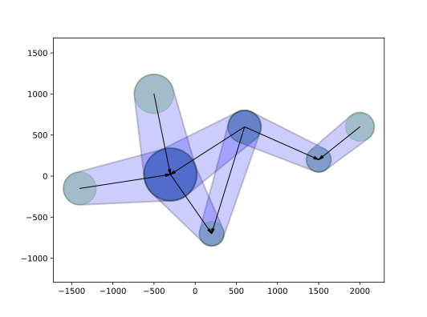
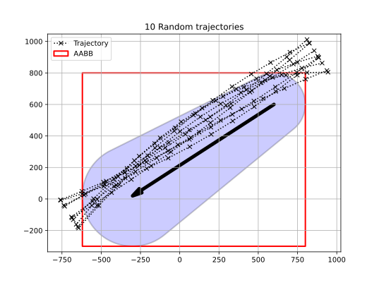
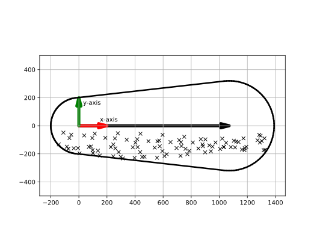
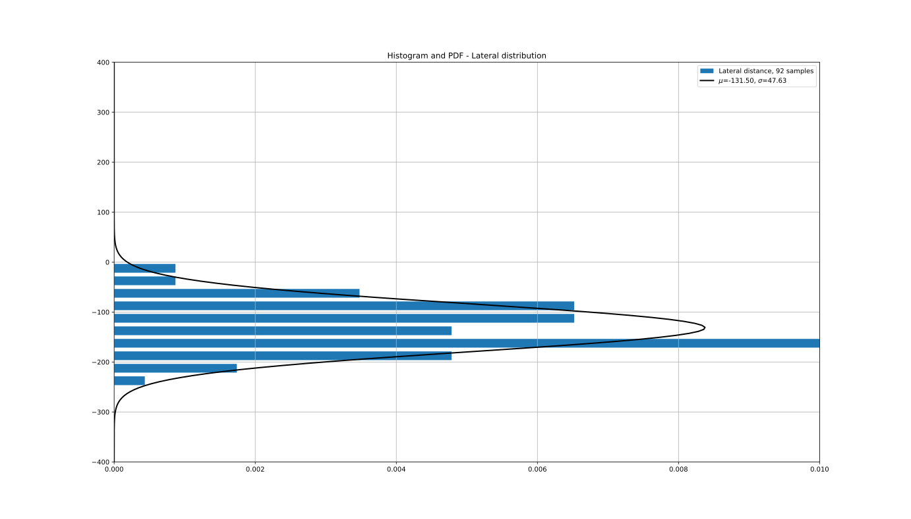

.. _`theory_traffic`:

Traffic
=======

There are two sources to obtain input for the traffic in an area: 

#.  Traffic data is directly derived from AIS (`Wiki <https://en.wikipedia.org/wiki/Automatic_identification_system>`_) data.

#.  Traffic data is derived from manual input.  

All registered AIS ships are distributed among the ship types and sizes defined in the :ref:`theory_ships` section. These ships 
are successively assigned to the links and cells in the :ref:`theory_area` definition.

Nomenclature
------------

+-------------------+----------------------------------------------------------------------------------------+
| Symbol            | Meaning                                                                                |
+===================+========================================================================================+
| :math:`{\Delta}t` | Delta time corresponding with the time unit of the observation                         |
+-------------------+----------------------------------------------------------------------------------------+
| :math:`s_t`       | Number of observations of a ship type on a link at timestamp t                         |
+-------------------+----------------------------------------------------------------------------------------+
| :math:`u`         | Speed over ground                                                                      |
+-------------------+----------------------------------------------------------------------------------------+
| :math:`A`         | Cell area                                                                              |
+-------------------+----------------------------------------------------------------------------------------+
| :math:`D`         | Total travelled length for each ship type in a cell per area and time unit             |
+-------------------+----------------------------------------------------------------------------------------+
| :math:`L`         | Total travelled length for each ship type in a cell                                    |
+-------------------+----------------------------------------------------------------------------------------+
| :math:`N`         | Time spent by a ship type on a link for a time interval                                |
+-------------------+----------------------------------------------------------------------------------------+
| :math:`Q`         | Number of passages of a ship type on a link per time unit for a time interval          |
+-------------------+----------------------------------------------------------------------------------------+
| :math:`T`         | Number of passages of a ship type on a link for a time interval                        |
+-------------------+----------------------------------------------------------------------------------------+

Traffic data derived from AIS data
----------------------------------

Traffic assigned to a link is tagged as bounded. Each link is respresented by a polygon with six edges. The size 
of the polygon can be manipulated by the radius of the waypoint. First the criteria to flag a ship passage as 
valid, must be verified. If so, the lateral passage offset value must be calculated. An example of a network 
with waypoints, links and polygons is displayed in :numref:`fig:network1`. The numbers in this example have no 
units and are shown for illustration purposes only.    

.. _fig:network1: 

     
    Six edges polygons

Link assignment
~~~~~~~~~~~~~~~

The listed criteria below are verified, before a sampled AIS position can be assigned to a link. 

Two criteria to verify the trajectory assignment of a link are applied:

#. The sampled ships AIS position must be inside a link polygon.

#. The ships course must be within predefined tolerances with respect to the links direction.
   If multiple links/polygons are valid, then the one with the smallest deviation from the links direction preveals.

AIS traffic is mapped to links and cells. Equidistant time steps are applied. For each timestamp and associated 
time step an attempt is made to assign ships and their attributes to a link.

These link attributes consists of the following four items: 

#. Link unique identifier

#. Lateral distance to the link. This value can either be positive or negative (see :ref:`theory_area` section).

#. Tangent distance to the link. This value corresponds with the position of the ship on the link.
   A tangent distance value of zero corresponds with a ship, which is at the first waypoint of a link.

#. Angle between the ships course and the heading of the link.
   The angle is the difference between the ship's course and the link's orientation. This value can be positive or negative.

   a. The ship's course is derived from two consecutive AIS samples.
   b. If no two consecutive AIS samples exists, the logged heading in the AIS sample is applied.

This approach results in a database with the following signals for each record:

*  Unique identifer

*  Cell unique identifier

*  Ship type and size unique identifier

*  Timestamp

*  Time step

*  Longitudinal position

*  Lateral position

*  Course

*  Speed over ground

*  Link unique identifier (if applicable)

*  Lateral position w.r.t. link (if applicable)

*  Tangent position w.r.t. link (if applicable)

*  Course deviation w.r.t. link (if applicable) 

The ship's Speed over Ground (SoG) is default derived from the AIS message. Alternatively, the speed 
is computed from two consecutive position samples divided by the time step.
   
Parameters :math:`T`, :math:`N` and :math:`Q` are computed for each ship type and size. These values are 
applicable for a selected time span. This time span is determined by the end timestamp (:math:`t=n`) minus
the start timestamp (:math:`t=0`).

.. math::   
    :label: eq_AIS_RB1
   
    T = \sum\limits_{t=0}^{n} s_{t} {\Delta}t
    
Integer :math:`s_{t}` corresponds with the assigned counted samples of a ship type to a link at timestamp :math:`t`. Parameter 
:math:`T` is the spent time by a ship type on a link. 

The number of passages for each ship type and size is equal to :math:`N`. 

.. math::   
    :label: eq_AIS_RB2
    
    N = \sum\limits_{t=0}^{n} s_{t} u \frac{{\Delta}t}{l}

The number of passages per time unit for each ship type and size (:math:`Q`) is computed as follows:
    
.. math::   
    :label: eq_AIS_RB3
    
    Q = \frac{N}{(n-1){\Delta{t}}}   

Parameters of the distribution function of the lateral position with respect to the 
link must be set for each ship type. These parameters must be based on sufficient 
data samples to obtain a reliable fit.

The following approaches apply in order of preference:

#. The samples of a ship type and size for a time span are used.

#. The samples of a ship type and size for a larger time span than the selected time span are used.  

#. Multiple ship types and sizes are grouped to obtain more data samples for a time span.

#. Property values are set based on expertise for similar type of traffic patterns and/or links.

As an example ten randomly generated trajectories are displayed to represent AIS samples (:numref:`fig:random`). One 
six edges polygon and its link from :numref:`fig:network1` are included. An Aligned Axis Bounded Box (AABB) 
is added to show how the data set is clipped before the rotation to the local frame of reference (:numref:`fig:valid`) 
is executed. A lateral distance histogram of the valid samples is created (:numref:`fig:hist_pdf`). The distribution 
function parameters (:numref:`fig:hist_pdf`) can be applied in the ship-ship head-on and overtaking models.    

.. _fig:random: 

     
    Random AIS trajectories plotted on link polygon

.. _fig:valid:    

     
    Valid link samples  

.. _fig:hist_pdf:

     
    Lateral position histogram and pdf     

Finally, the following data is derived from this database for assigned route-bounded ships:

*  Number of passages per time unit for link (:math:`i`) for each ship type and size (:math:`j`): :math:`Q_{ij}` 

*  The mean value of the lateral distribution: :math:`\mu_{ij}`

*  The sigma value of the lateral distribution: :math:`\sigma_{ij}`

Cell assignment
~~~~~~~~~~~~~~~

Ussigned ships to links are assigned to a cell. The approach is similar as equation :math:numref:`eq_AIS_RB1` and 
with a minor adjustment to equation :math:numref:`eq_AIS_RB2`.

.. math::   
    :label: eq_AIS_NRB1
   
    T = \sum\limits_{t=0}^{n} s_{t} {\Delta}t
    
Integer :math:`s_{t}` corresponds with the counted samples of a ship size in a cell at timestamp :math:`t`. Parameter 
:math:`T` is the spent time by a ship type in a cell. 

The total travelled length for each ship type in a cell is equal to :math:`L`. 

.. math::   
    :label: eq_AIS_NRB2
    
    L = \sum\limits_{t=0}^{n} s_{t} u {\Delta}t
    
Equation :math:numref:`eq_AIS_NRB2` can be modified, such that it is applicable per unit cell area and unit time.    

.. math::   
    :label: eq_AIS_NRB3
    
    D = \frac{L}{A(n-1){\Delta{t}}}  

Where :math:`A` is the cell area and the term :math:`(n-1)\Delta{t}` the time span of the observations.

Finally, the following data is derived from this database for unassigned route-bounded ships and non-route-bounded ships:    

*  The density is defined as :math:`D_{ij}` for each cell (:math:`i`) and each ship type and size (:math:`j`) in 
   the area. It indicates the travelled distance per unit area (:math:`m^2`) and unit time (:math:`s`) for a cell. 

Traffic data derived from manual input
--------------------------------------

From the previous section it can be observed that properties :math:`Q_{ij}`, :math:`\mu_{ij}` and :math:`\sigma_{ij}` are 
required for the models with route-bounded ships. Property :math:`D_{ij}` is needed for the unassigned route-bounded ships 
and the non-route-bounded ships. For completeness this input is summarized in this section. Property values are assigned 
manually.

Link assignment
~~~~~~~~~~~~~~~

For each link (:math:`i`) and each ship type (:math:`j`) in the area the following parameters must be defined:

*  Number of ships sailing on the link :math:`Q_{ij}`

*  The mean value of the distribution :math:`\mu_{ij}`

*  The sigma value of the distribution :math:`\sigma_{ij}`

The distribution parameters refer to the lateral position offset with respect to the link. 

Cell assignment
~~~~~~~~~~~~~~~

For each cell (:math:`i`) and each ship type (:math:`j`) in the area the density is 
defined as :math:`D_{ij}`. It indicates the travelled distance per unit area (:math:`m^2`) and unit 
time (:math:`s`) for this particular cell. 

