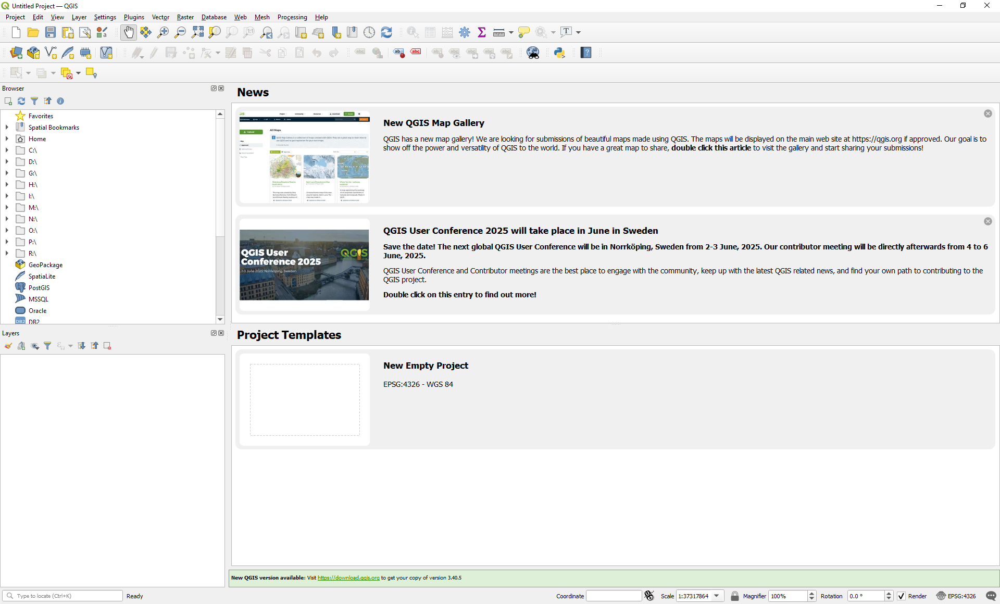
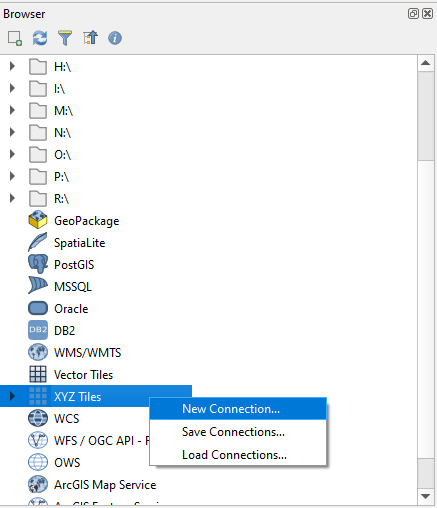
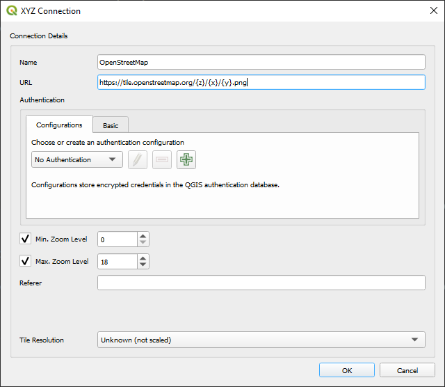
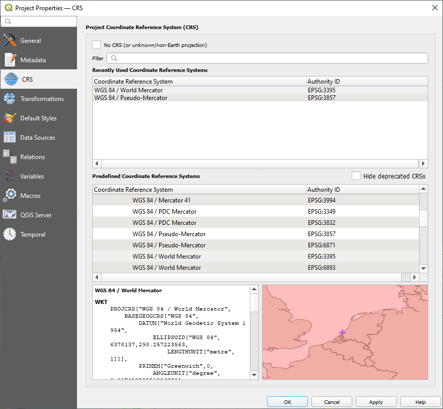
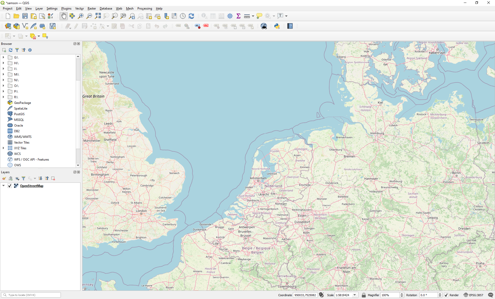
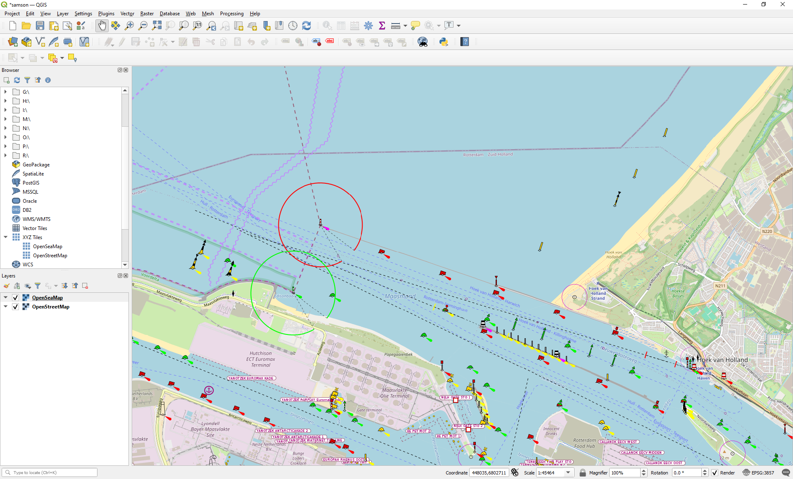

.. _`tutorial_qgis`:

Set-up QGIS for SAMSON 
======================

It is suggested to use QGIS to configure the SAMSON building blocks for the area composition. This will allow you to inspect your anomaly calculation inputs. 
QGIS is a powerful open-source geographic information system that can help you visualize and analyze spatial data effectively.

Configuring a QGIS project for SAMSON computations can streamline your workflow and ensure accurate spatial analysis. In this tutorial is explained how you 
configure a QGIS project for your SAMSON computations. The end result can also be downloaded: :download:`QGIS project file <./downloads/samson.qgz>`

Download and install QGIS
-------------------------

QGIS is a geographic information system (GIS) software that is free and open-source. It supports viewing, editing, printing, and analysis of geospatial 
data in a range of data formats (`Wiki <https://en.wikipedia.org/wiki/QGIS>`_). This is the link to the `QGIS <https://qgis.org/>`_ project website. You 
can download and install QGIS from the project website. Starting up QGIS will present you with a user-friendly interface.

Typically, you'll see:

.. glossary::

   Menu Bar
      At the top, providing access to various tools and settings.

   Toolbars
      Below the menu bar, offering quick access to frequently used functions.

   Layers Panel
      On the left side, where you can manage and organize your data layers.

   Map Canvas
      The central area where your spatial data is displayed.

   Status Bar
      At the bottom, showing information about the current map view and coordinates.

     
    Opened QGIS application window 

Connect to OpenStreetMap
------------------------

First we have to establish a connection to a OpenStreetMap (OSM) tiles server. This server will be the first layer in our project to be 
displayed. An internet connection is needed to display this layer.

Here are the basic steps to add a connection to a OSM tiles server:

*  Go to the ``Browser`` panel on the left side of the QGIS window. If you don't see the ``Browser`` panel, you can enable it 
   by going to ``View > Panels > Browser``.

*  Create a new connection: Right-click on ``XYZ Tiles`` in the ``Browser`` panel. Select ``New Connection``.

     
    Create new XYZ tiles connection 

*  Configure the connection:

   *  In the ``Name`` field, enter a name for your connection (e.g., *OpenStreetMap*).
   
   *  In the ``URL`` field, enter the following URL: 
      *https://tile.openstreetmap.org/{z}/{x}/{y}.png*
   
   *  Click ``OK`` to save the connection.
   

     
    Configure XYZ tiles connection to OSM   

Create a QGIS project
---------------------

Now we create a QGIS project. This is a straightforward process. 

Here are the basic steps to create a project:

*  Click on ``Project`` in the menu bar and select ``New`` to create a new project.

*  Go to ``Project > Save As``, choose a name and location for your project, and click ``Save``.

*  Ensure your project is using the approperiate Coordinate Reference System (CRS). You can set this by clicking on the CRS status in the 
   bottom-right corner of the QGIS window.
   
*  Select *WGS 84 / World Mercator EPSG:3395* and click ``apply``.

*  Regularly save your project by clicking ``Project > Save``.

Insert an OpenStreetMap layer
-----------------------------

Next, we'll add a new layer featuring OpenStreetMap content to your project. 

Here are the basic steps to add this layer to your project:

*  In the browser panel, find your newly created XYZ tiles connection.

*  Drag and drop it into the main QGIS window or right-click and select ``Add Layer to Project``.

*  This will add the XYZ Tiles layer to your QGIS project, providing a detailed map background.

     
    OpenStreetMap layer in your QGIS project 

Insert an OpenSeaMap layer
--------------------------

Now we will repeat the above steps to add the `OpenSeaMap <https://map.openseamap.org/>`_ to our project. This second layer will add a nautical 
chart to our map canvas.  

Here are the basic steps to connect to OpenSeaMap with a XYZ Tiles connection and create a second layer with this connection to your project:

*  Create a new connection: Right-click on ``XYZ Tiles`` in the ``Browser`` panel. Select ``New Connection``. 

*  Configure the connection:

   *  In the ``Name`` field, enter a name for your connection (e.g., *OpenSeaMap*).
   
   *  In the ``URL`` field, enter the following URL:
      *https://t1.openseamap.org/seamark/{z}/{x}/{y}.png*
   
   *  Click ``OK`` to save the connection.
   
*  Drag and drop it into the main QGIS window or right-click and select ``Add Layer to Project``.   

     
    Add OpenSeaMap layer in your QGIS project 
    
Your QGIS project is now set up and ready for your SAMSON project. You can add additional SAMSON building block layers on top of the two 
existing layers in this project.   

.. tip::
   You can add Google satellite images as a raster layer to your project using the following URL: *http://mt0.google.com/vt/lyrs=s&hl=en&x={x}&y={y}&z={z}* . 
   Ensure that your OpenSeaMap layer is enabled and positioned above the Google layer to make it visible.