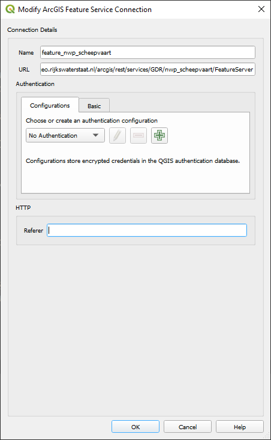
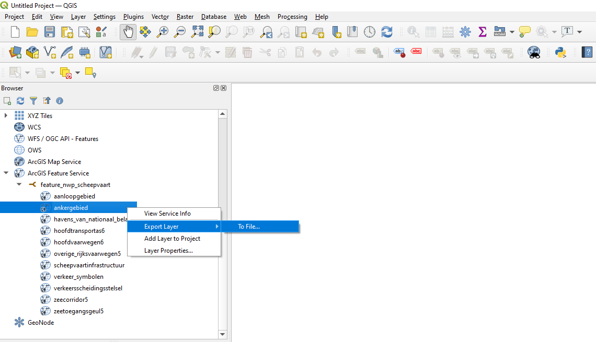
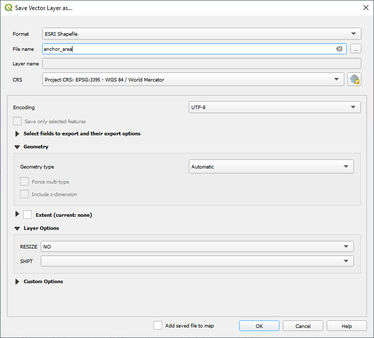
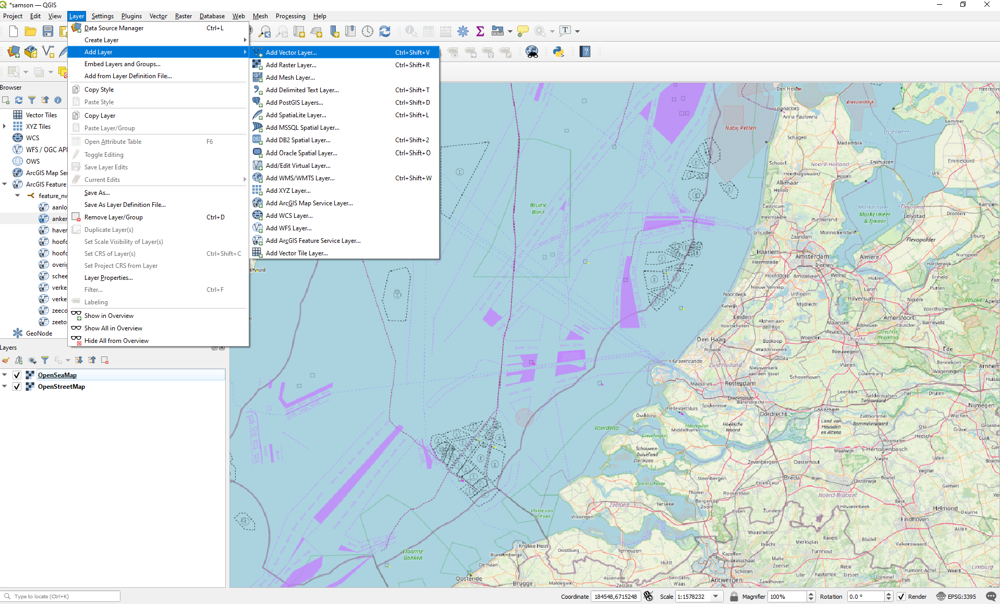
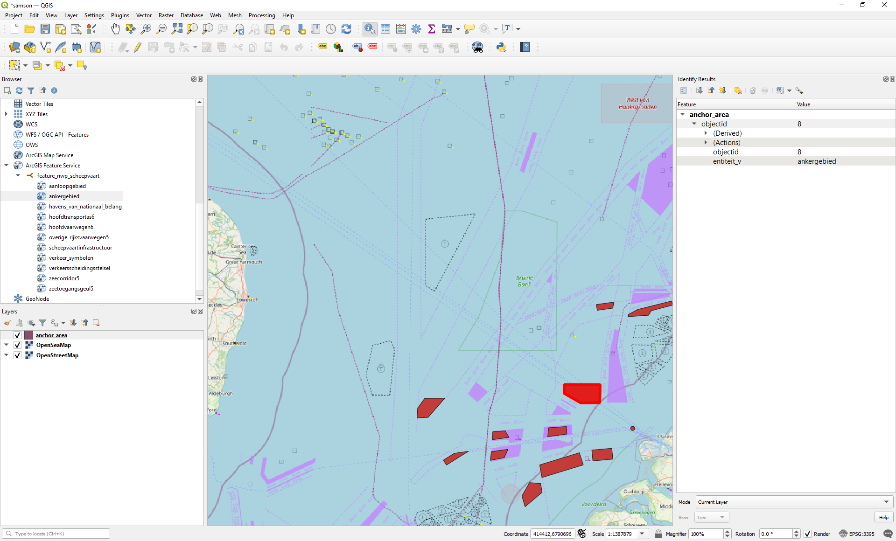

.. _`tutorial_qgis_anchor`:

Anchor area geometry
====================

This tutorial explains how to obtain anchor area data from an ArcGIS server. This dataset serves as the foundation for the safety assessment in SAMSON. 
After establishing a connection to the Rijkswaterstaat server, we display the anchor area in a QGIS layer. Subsequently, the content of this layer is 
exported as a shapefile. The end result can also be downloaded: :download:`QGIS project file <./downloads/samson.qgz>`

Connect to RWS ArcGIS server
----------------------------

Generally, there are two types of ArcGIS services: map services and feature services. Map services are ideal for fast, static map displays, while 
feature services are better suited for interactive applications that require direct data manipulation. In this tutorial, we will acquire the anchor area 
shapefile for our SAMSON computation by connecting to an ArcGIS Feature Service.  

Here are the basic steps to add a connection to a ArcGIS server:

*  Go to the ``Browser`` panel on the left side of the QGIS window. If you don't see the ``Browser`` panel, you can enable it 
   by going to ``View > Panels > Browser``.

*  Create a new connection: Right-click on ``ArcGIS Feature Service`` in the ``Browser`` panel. Select ``New Connection``.

*  Configure the connection:

   *  In the ``Name`` field, enter a name for your connection (e.g., *feature_nwp_scheepvaart*).
   
   *  In the ``URL`` field, enter the following URL: 
      *https://geo.rijkswaterstaat.nl/arcgis/rest/services/GDR/nwp_scheepvaart/FeatureServer*
      
   *  No authentication is needed to make the connection with this server.
   
   *  Click ``OK`` to save the connection.

     
    New QGIS ArcGIS connection  

Export Shapefile
----------------

Now we export a feature layer from our ArcGIS service. 

Here are the basic steps to create this export:

*  Unfold to the created ArcGIS connection and inspect the multiple available feature layers. We are interested in layer ``ankergebied``.

*  Right-click on ``Export Layer > To File``, to configure the shapefile you are going to export.

    
    Export a layer from the ArcGIS service   

*  Configure the export:
   
   *  Format is ``ESRI Shapefile``.
   
   *  Fill in a ``file`` name and specifiy the export directory (``browse``) next to it.
   
   *  Add the ``CRS`` specification. Here we specify ``EPSG-3395 - WGS 84 / World Mercator``.

    
    Configure the export of a shapefile    

.. note::
   Shapefiles (`Wiki <https://en.wikipedia.org/wiki/Shapefile>`_) are a popular geospatial vector data format used in Geographic Information System (GIS) 
   software. Developed by Esri, they are designed to store the geometric location and attribute information of geographic features such as points, lines, 
   and polygons.
   A shapefile is actually a collection of files with the same base name but different extensions, typically including:
   
   *  .shp: Contains the geometry data (the shapes themselves).
   *  .shx: An index file that allows for quick access to the geometry data.
   *  .dbf: Stores attribute data in a tabular format, similar to a spreadsheet.
   
   Shapefiles are widely used because they are simple and compatible with many GIS applications, although they do have some limitations, such as a lack of 
   support for topological information
   
Import Shapefile
----------------

Next, we'll import the exported Shapefile into our QGIS project from the previous tutorial. This project includes the OpenStreetMap and OpenSeaMap layers.

Here are the basic steps to execute this import:

*  Click ``Layer > Add layer > Add vector Layer``

    
    Add vector layer to import anchor Shapefile 

*  Specify the name and location of the exported Shapefile in the ``Vector Dataset(s)`` field followed by ``Add`` and ``Close``.

*  Your imported anchor areas are now displayed as closed polygons. Each polygon has an unique identifier, which can be retrieved with the 
   ``Identify Features`` button or the shortcut ``crtl+shift+i``. We have now reached the stage where we can modify our geometrical dataset 
   for computational purposes.

    
    Feature info

.. tip::
   Alternatively, you can drag and drop your the *ankergebied* into your QGIS project. 