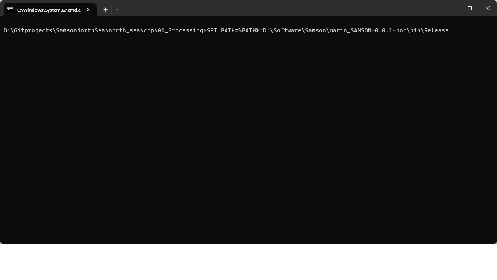
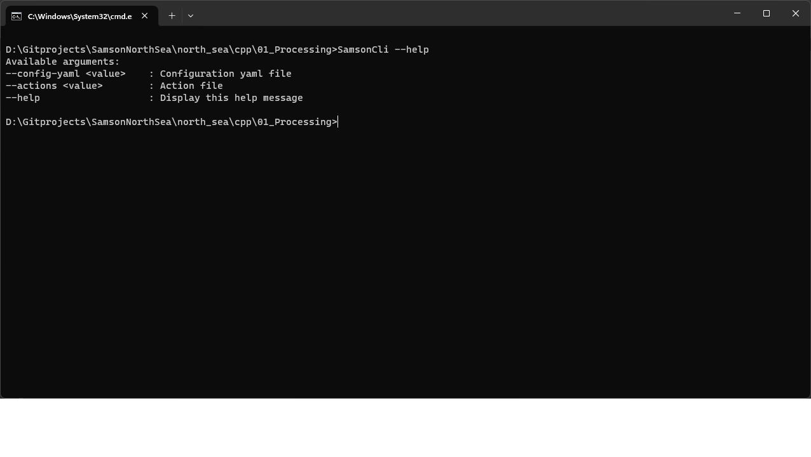
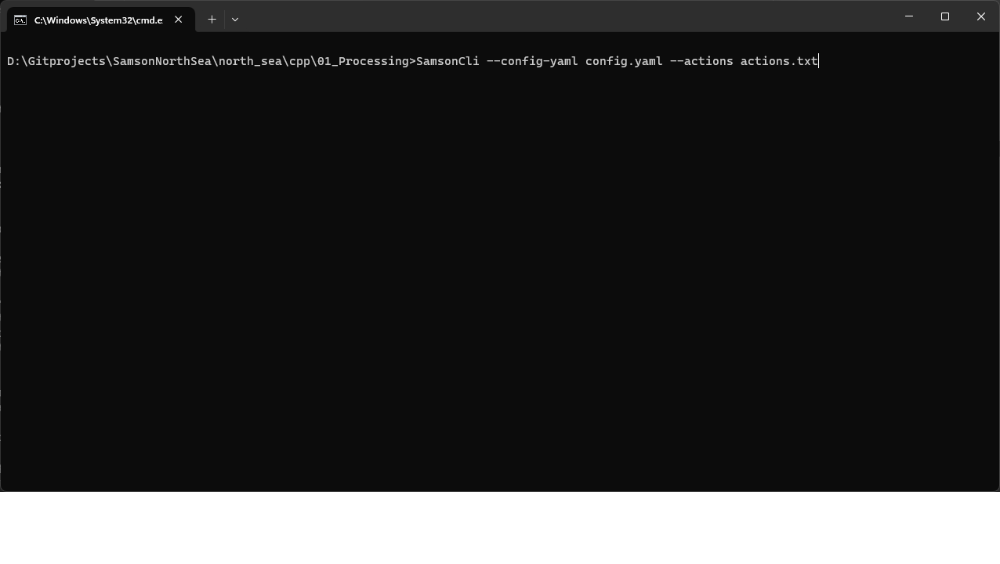

.. _`user_guide_getting-started`:

Getting Started
===============

     
    Add SamsonCli executable path to the path variable

:code:`SamsonCli --help`

     
    SamsonCli help

:code:`SamsonCli --config-yaml config.yaml --actions actions.txt`

     
    SamsonCli run

:code:`config.yaml`
    
.. code-block:: yaml

    ---
    apiVersion : "0.0.2"
    inputLocation: "\\Rotterdam\\"
    outputLocation: "\\Results\\"
    exportLocation: "\\Exports\\"
    areaModel:
      vertices: "Area\\vertices.csv"
      waypoints: "Area\\waypoints.csv"
      links: "Area\\links.csv"
      cells: "Area\\cells.csv"
      objects: "Area\\objects.csv"
      weatherstations: "Area\\weatherstations.csv"
      windstrength: "Area\\windstrength.csv"
      winddirection: "Area\\winddirection.csv"
      ertvs: "Area\\ertvs.csv"
      zones: "Area\\zones.csv"
    trafficModel:
      shipCategories: "Traffic\\shipcategories.csv"
      shipsOnLinks: "Traffic\\shiplinks.csv"
      shipsOnCells: "Traffic\\shipcells.csv"
    interactionModel:
      model: "sem"
      shipLinkData: "ModelData\\shiplinkdata.csv"
      shipCellData: "ModelData\\shipcelldata.csv"
      causationFactors: "Causation\\causationfactors.csv"
      pilotassistance_ship: "Measures\\pilotassistanceship.csv"
      pilotassistance_zone: "Measures\\pilotassistancezone.csv"
    logger:
      fileName: "samson.log"
      logLevel: "verbose"      

:code:`actions.txt`

.. code-block::
      
    # actions usually come in the format of [action] [target] [aspect=area/traffic/exposure/event/measure] [command] [command input]
    # the actions are load/modify/save/compute

    # This example shows how to modify the area of the TrafficDataBase and inspect is visually through shapefiles
    load TrafficDataBase
    save TrafficDataBase area shapefile

    # Compute desirable TrafficDataBase components
    compute TrafficDataBase exposure
    compute TrafficDataBase event
    compute TrafficDataBase collision

    # Save the results
    save TrafficDataBase results csv
