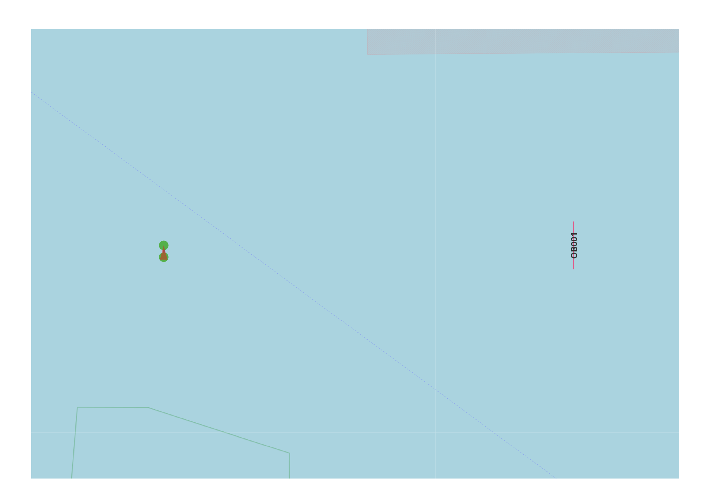

Drift Engine Repair Function
----------------------------

General
^^^^^^^

:Objective:
  Verify that the computed exposure, event, and collision frequencies for a drifting ship align with the theoretical model, 
  and confirm that the engine repair function is correctly implemented. 
:Criteria:
  The calculated collision frequency must correspond with the reference values produced in the test script for this simplified scenario.

In this test case, the weather condition is set to Beaufort force 5 with an eastward wind. The setup includes one link and a single 
object represented as a line. Both current and tide are set to zero. The longitudinal position of the object is incrementally varied 
within a loop. Collision frequencies between the ship on the link and the object are logged and compared with the values calculated 
in the test script. In this simplified scenario, the expected exposure corresponds with the full length of the link.

   Test set-up

Input
^^^^^

.. csv-table:: weatherstations.csv
   :file: ./Area/weatherstations.csv
   :widths: auto
   :header-rows: 1

.. csv-table:: windstrength.csv
   :file: ./Area/windstrength.csv
   :widths: auto
   :header-rows: 1

.. csv-table:: winddirection.csv
   :file: ./Area/winddirection.csv
   :widths: auto
   :header-rows: 1

.. csv-table:: shipcategories.csv
   :file: ./Traffic/shipcategories.csv
   :widths: auto
   :header-rows: 1

.. csv-table:: shiplinkdata.csv
   :file: ./ModelData/shiplinkdata.csv
   :widths: auto
   :header-rows: 1

.. csv-table:: shiplinks.csv
   :file: ./Traffic/shiplinks.csv
   :widths: auto
   :header-rows: 1

.. csv-table:: objects.csv
   :file: ./Area/objects.csv
   :widths: auto
   :header-rows: 1

Result
^^^^^^

.. _fig_Comparison_Collisions_Link_Object_Engine_Repair:

.. figure:: figure1.svg
   :alt: Comparison:Collisions:Link:Object:Engine:Repair
   :align: center

   Drift collisions versus the longitude coordinate of the object

.. literalinclude:: .check_output.txt
