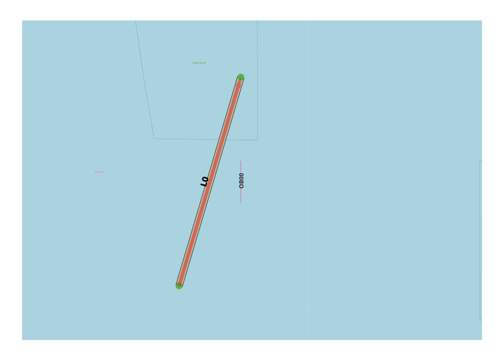

Drift and Ram Causation Factors
-------------------------------

General
^^^^^^^

:Objective:
  Verify the correct implementation of causation factors for drift and ram.
:Criteria:
  The causation factors must be accurately multiplied with the drift and ram exposure values to yield valid event outcomes.    

A single vessel is assigned to a specific link, with one object positioned nearby. Drift and ram exposure values are extracted 
from the output results file and combined with the designated causation factors. This process should produce the expected 
number of drift and ram events.

    
   Test set-up

Input
^^^^^

.. csv-table:: shipcategories.csv
   :file: ./Traffic/shipcategories.csv
   :widths: auto
   :header-rows: 1

.. csv-table:: shiplinkdata.csv
   :file: ./ModelData/shiplinkdata.csv
   :widths: auto
   :header-rows: 1
   
.. csv-table:: shiplinks.csv
   :file: ./Traffic/shiplinks.csv
   :widths: auto
   :header-rows: 1  
   
.. csv-table:: objects.csv
   :file: ./Area/objects.csv
   :widths: auto
   :header-rows: 1 

.. csv-table:: causationfactors.csv
   :file: ./Causation/causationfactors.csv
   :widths: auto
   :header-rows: 1 

Result
^^^^^^

.. literalinclude:: .check_output.txt