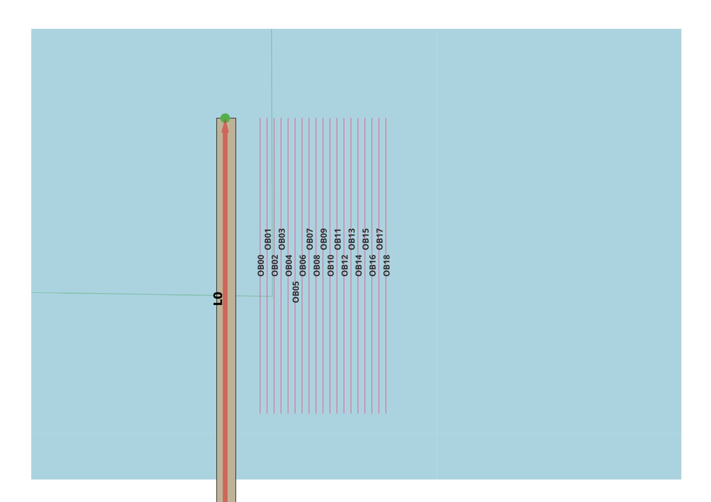

Drift and Ram Exposure Gradients
--------------------------------

General
^^^^^^^

:Objective:
  Verify the gradient of computed exposure frequency for a single link and multiple objects.
:Criteria:
  The exposure frequency should decrease, if the distance between the object and link increases.  

One ship is allocated to a specific link. A total of nineteen parallel objects are positioned at regular 
intervals along the longitudinal axis. Each object is modeled as an identical linestring consisting of just 
two vertices. It is anticipated that drift exposure will diminish as the distance between the object and the 
link increases. This same relationship applies consistently to drift exposure. The same pattern is expected 
for ram exposures. 

    
   Test set-up

Input
^^^^^

.. csv-table:: weatherstations.csv
   :file: ./Area/weatherstations.csv
   :widths: auto
   :header-rows: 1

.. csv-table:: windstrength.csv
   :file: ./Area/windstrength.csv
   :widths: auto
   :header-rows: 1

.. csv-table:: winddirection.csv
   :file: ./Area/winddirection.csv
   :widths: auto
   :header-rows: 1
   
.. csv-table:: shipcategories.csv
   :file: ./Traffic/shipcategories.csv
   :widths: auto
   :header-rows: 1

.. csv-table:: shiplinkdata.csv
   :file: ./ModelData/shiplinkdata.csv
   :widths: auto
   :header-rows: 1
   
.. csv-table:: shiplinks.csv
   :file: ./Traffic/shiplinks.csv
   :widths: auto
   :header-rows: 1  
   
.. csv-table:: objects.csv
   :file: ./Area/objects.csv
   :widths: auto
   :header-rows: 1 

Result
^^^^^^

.. _fig_Gradient:

.. figure:: figure1.svg
   :alt: Gradient
   :align: center
     
   Ram and drift gradient

.. literalinclude:: .check_output.txt