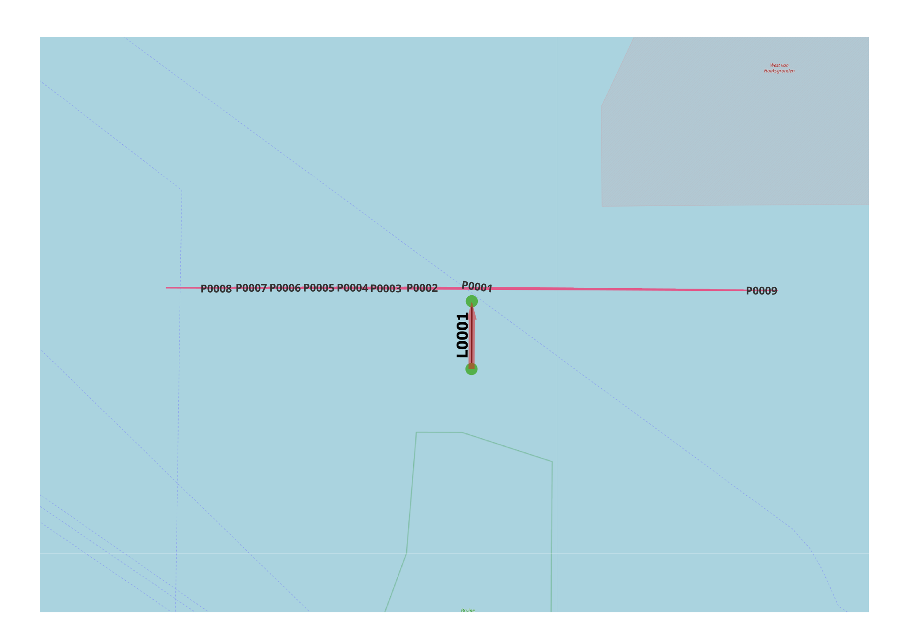

Large Object Exposure
---------------------

General
^^^^^^^

:Objective:
  Determine whether objects positioned near the end of a link are correctly detected and recorded as exposures.
:Criteria:
  The exposure frequency should decrease as the object’s width becomes smaller. 

An object is represented as a linestring placed in front of a link. Its two vertices are positioned symmetrically with respect to the link.  

    
   Test set-up

Input
^^^^^

.. csv-table:: shipcategories.csv
   :file: ./Traffic/shipcategories.csv
   :widths: auto
   :header-rows: 1

.. csv-table:: shiplinkdata.csv
   :file: ./ModelData/shiplinkdata.csv
   :widths: auto
   :header-rows: 1
   
.. csv-table:: shiplinks.csv
   :file: ./Traffic/shiplinks.csv
   :widths: auto
   :header-rows: 1  
   
.. csv-table:: objects.csv
   :file: ./Area/objects.csv
   :widths: auto
   :header-rows: 1 

Result
^^^^^^

.. literalinclude:: .check_output.txt