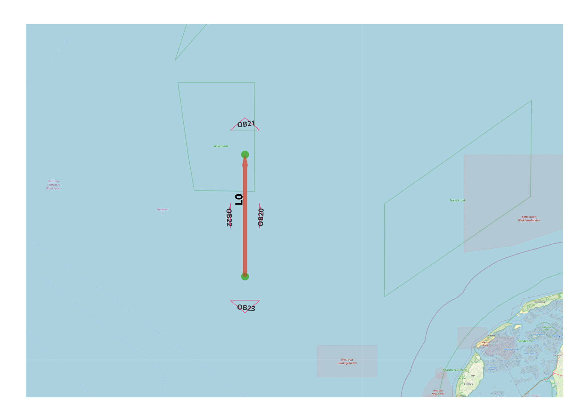

Ram Object Discretization
-------------------------

General
^^^^^^^

:Objective:
  Verify the influence of the object symmetry and shape for the computed ram exposure frequencies.
:Criteria:
  The exposure frequency should be symmetrical for objects located west and east.
  No exposures are expected for the objects south.
  The exposures for all objects east are identical.
  The exposures for all objects north are identical.
  The exposures for all objects west are identical.  

A single ship is assigned to a designated link. Twelve objects are distributed across the cardinal 
directions: east, north, west, and south. Each direction contains three objects—one is a linestring with a 
single segment, another is a linestring composed of two segments, and the third is a polygon formed by three 
segments. Regardless of their geometry, all objects should have identical exposure.

    
   Test set-up

Input
^^^^^

.. csv-table:: shipcategories.csv
   :file: ./Traffic/shipcategories.csv
   :widths: auto
   :header-rows: 1

.. csv-table:: shiplinkdata.csv
   :file: ./ModelData/shiplinkdata.csv
   :widths: auto
   :header-rows: 1
   
.. csv-table:: shiplinks.csv
   :file: ./Traffic/shiplinks.csv
   :widths: auto
   :header-rows: 1  
   
.. csv-table:: objects.csv
   :file: ./Area/objects.csv
   :widths: auto
   :header-rows: 1 

Result
^^^^^^

.. literalinclude:: .check_output.txt