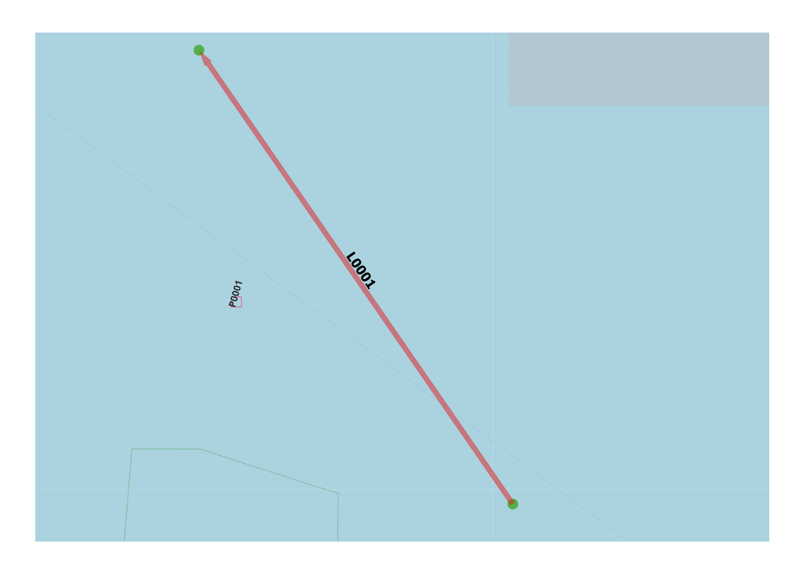

Object Elevation
----------------

General
^^^^^^^

:Objective:
  Verify that the object elevation variable functions correctly in combination with the ship’s height and draft.
:Criteria:
  Any object elevations lying outside the vertical boundaries defined by the ship’s bottom and top surfaces must be filtered out.

The ship is modeled as a rectangular block with a defined length, width, and height. Its vertical position in the water is 
determined by the ship’s draft parameter.

* A positive draft results in a block that is partially or fully submerged, depending on the block height.
* A negative draft places the entire block above the waterline, fully exposed to wind.

When the vessel is drifting, its longitudinal area is split into a wetted area and a windage area, which together determine 
the time until an object intersects with the ship.
In this test, five objects are defined, each consisting of four vertices but having different elevations: –4, –2, 0, 2, and 4 meters. 
The ship has a height of 10 meters. The draft is gradually increased so that the number of detectable elevations increases from 1 to 5, 
and then decreases again back to 1. In the initial stage of the experiment the vessel behaves as if it were a submarine, while in the 
final stage it effectively resembles an aircraft.

    
   Test set-up

Input
^^^^^

.. csv-table:: weatherstations.csv
   :file: ./Area/weatherstations.csv
   :widths: auto
   :header-rows: 1
   
.. csv-table:: windstrength.csv
   :file: ./Area/windstrength.csv
   :widths: auto
   :header-rows: 1  

.. csv-table:: winddirection.csv
   :file: ./Area/winddirection.csv
   :widths: auto
   :header-rows: 1     

.. csv-table:: shipcategories.csv
   :file: ./Traffic/shipcategories.csv
   :widths: auto
   :header-rows: 1

.. csv-table:: shiplinkdata.csv
   :file: ./ModelData/shiplinkdata.csv
   :widths: auto
   :header-rows: 1
   
.. csv-table:: shiplinks.csv
   :file: ./Traffic/shiplinks.csv
   :widths: auto
   :header-rows: 1  
   
.. csv-table:: objects.csv
   :file: ./Area/objects.csv
   :widths: auto
   :header-rows: 1 

Result
^^^^^^

.. _fig_Comparison_Exposures_Link_Object_Elevation:

.. figure:: figure1.svg
   :alt: Comparison:Exposures:Link:Object:Elevation
   :align: center

   Number of drift exposures versus ship's draft

.. literalinclude:: .check_output.txt
