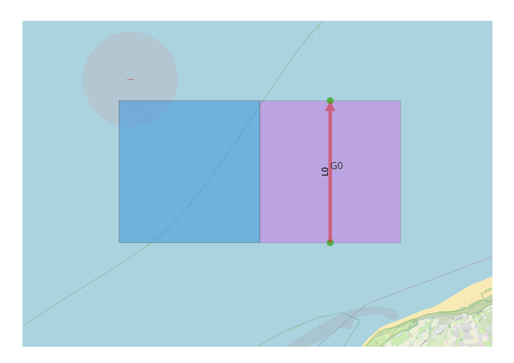

Sliding Distribution of Link
----------------------------

General
^^^^^^^

:Objective:
  Verify the computed exposure frequency between a cell and a link.

:Criteria:
  The computed exposure frequency is evaluated by comparing it against the reference values produced by the test script.

A link is positioned at the centre of a cell. Its waypoints are aligned with the midpoints of the cell’s lower and 
upper edges. The cell width is computed using the haversine formula. The value of :math:`\sigma` is defined as 
:math:`\text{width} / 6`. The parameter :math:`\mu` is varied in equal steps from :math:`-\text{width}` to :math:`+\text{width}`. 
The resulting evolution of the computed exposures as a function of :math:`\mu` is then evaluated.

   Test set-up last experiment

Input
^^^^^

.. csv-table:: shipcategories.csv
   :file: ./Traffic/shipcategories.csv
   :widths: auto
   :header-rows: 1

.. csv-table:: shiplinkdata.csv
   :file: ./ModelData/shiplinkdata.csv
   :widths: auto
   :header-rows: 1

.. csv-table:: shiplinks.csv
   :file: ./Traffic/shiplinks.csv
   :widths: auto
   :header-rows: 1

.. csv-table:: shipcelldata.csv
   :file: ./ModelData/shipcelldata.csv
   :widths: auto
   :header-rows: 1

.. csv-table:: shipcells.csv
   :file: ./Traffic/shipcells.csv
   :widths: auto
   :header-rows: 1

Result
^^^^^^

.. _fig_Comparison_Exposures_Link_Sliding_distribution:

.. figure:: figure1.svg
   :alt: Comparison:Exposures:Link:Sliding:disribution
   :align: center
     
   Exposures versus :math:`\mu` value of link distribution

.. literalinclude:: .check_output.txt