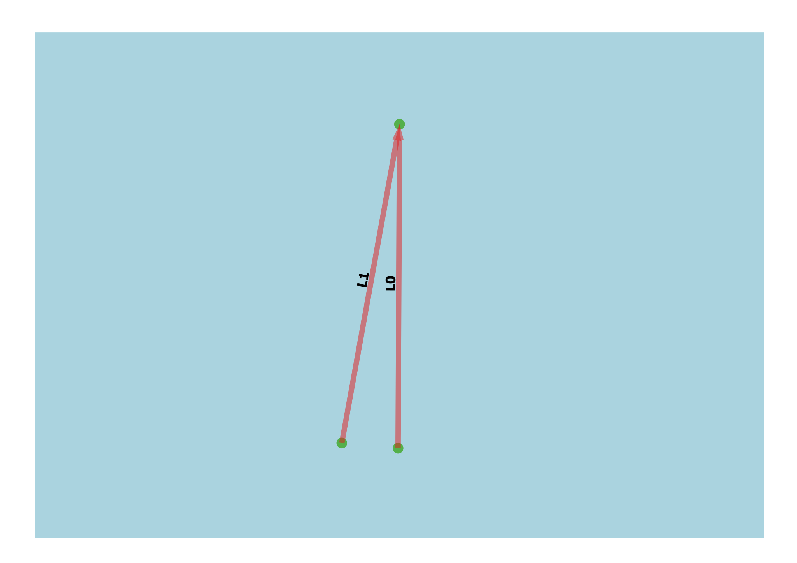

Crossing Model
--------------

General
^^^^^^^

:Objective:
  Verify the computed crossing exposure frequency for two ships with the crossing model.
:Criteria:
  The calculated exposure frequency is compared with the computed value in the test script. 

Two links are connected through a shared waypoint. The relative angle between them is varied from 0deg to 360deg in 10deg increments. 
The outputs from all 37 configurations are verified against the exposure frequency calculated in the test script.

    
   Test set-up

Input
^^^^^

.. csv-table:: shipcategories.csv
   :file: ./Traffic/shipcategories.csv
   :widths: auto
   :header-rows: 1

.. csv-table:: shiplinkdata.csv
   :file: ./ModelData/shiplinkdata.csv
   :widths: auto
   :header-rows: 1
   
.. csv-table:: shiplinks.csv
   :file: ./Traffic/shiplinks.csv
   :widths: auto
   :header-rows: 1   

Result
^^^^^^

.. literalinclude:: .check_output.txt
