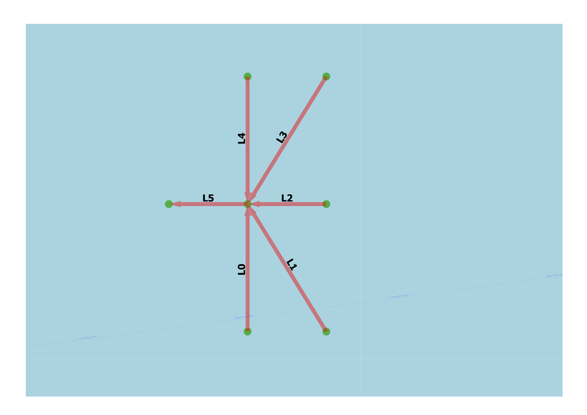

Crossing Model with Multiple Links
----------------------------------

General
^^^^^^^

:Objective:
  Verify the calculated crossing exposures when multiple links converge at a single waypoint.
:Criteria:
  Identify all pairs of links that share a common waypoint. For each pair, compare the exposure 
  rates, ensuring they are symmetric and non-zero. 

Five links terminate at a single common waypoint, each with specified traffic and equal frequency. 
This configuration should yield nine unique link pairs, each with an associated exposure frequency. An 
additional link connects at its starting point to the waypoint and should be excluded from the 
analysis. 

    
   Test set-up

Input
^^^^^

.. csv-table:: shipcategories.csv
   :file: ./Traffic/shipcategories.csv
   :widths: auto
   :header-rows: 1

.. csv-table:: shiplinkdata.csv
   :file: ./ModelData/shiplinkdata.csv
   :widths: auto
   :header-rows: 1
   
.. csv-table:: shiplinks.csv
   :file: ./Traffic/shiplinks.csv
   :widths: auto
   :header-rows: 1  

Result
^^^^^^

.. literalinclude:: .check_output.txt