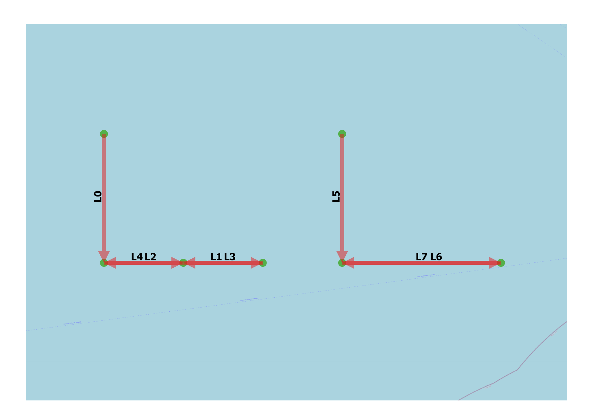

Discretization of Multiple Links
--------------------------------

General
^^^^^^^

:Objective:
  Verify that the discretization of the link has no impact on the number of computed exposures.
:Criteria:
  Two link discretizations with equal traffic and total link lengths should return identical exposures.   

The exposure frequency depend on the link length (:math:`L`) for the route-bound head-on model. A link 
connects two way points. Traffic is assigned to this link. A new instance of this set-up is made. An additional waypoint is 
positioned in between the two existing waypoints and the number of links are doubled. The assigned traffic of the initial 
set-up is transferred to the new links. Identical number of crossing and head-on exposures are expected for both set-ups.

    
   Test set-up

Input
^^^^^

.. csv-table:: shipcategories.csv
   :file: ./Traffic/shipcategories.csv
   :widths: auto
   :header-rows: 1

.. csv-table:: shiplinkdata.csv
   :file: ./ModelData/shiplinkdata.csv
   :widths: auto
   :header-rows: 1
   
.. csv-table:: shiplinks.csv
   :file: ./Traffic/shiplinks.csv
   :widths: auto
   :header-rows: 1  

Result
^^^^^^

.. literalinclude:: .check_output.txt