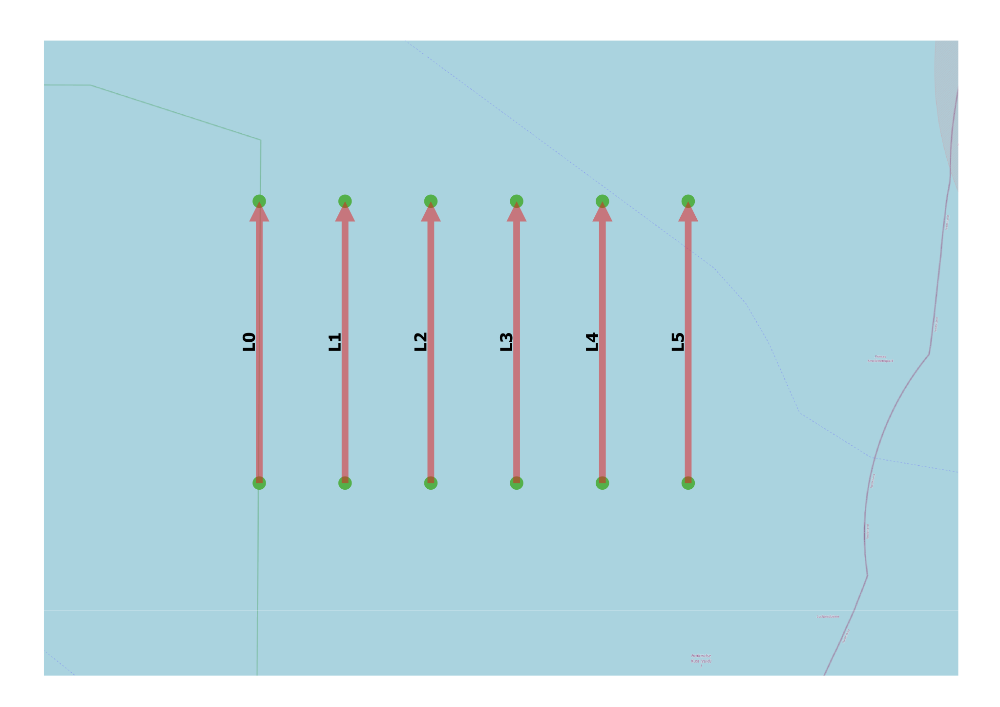

Overtaking Model Distribution
-----------------------------

General
^^^^^^^

:Objective:
  Verify the computed overtaking exposure frequency for two ships with the overtaking model with six (6) identical set-ups.
:Criteria:
  The calculated exposure frequency for all six (6) set-ups should be identical.  

Each link has two ship cateogries characterized by its velocity, width, and frequency. A normal lateral distribution is assumed, with 
both ship types having defined mean values (:math:`\mu`) and standard deviations (:math:`\sigma`). The standard deviation remains 
constant across all configurations. While the mean values vary between set-ups, the absolute distance between the two distributions' 
means remains the same.  

    
   Test set-up

Input
^^^^^

.. csv-table:: shipcategories.csv
   :file: ./Traffic/shipcategories.csv
   :widths: auto
   :header-rows: 1

.. csv-table:: shiplinkdata.csv
   :file: ./ModelData/shiplinkdata.csv
   :widths: auto
   :header-rows: 1
   
.. csv-table:: shiplinks.csv
   :file: ./Traffic/shiplinks.csv
   :widths: auto
   :header-rows: 1  

Result
^^^^^^

.. literalinclude:: .check_output.txt